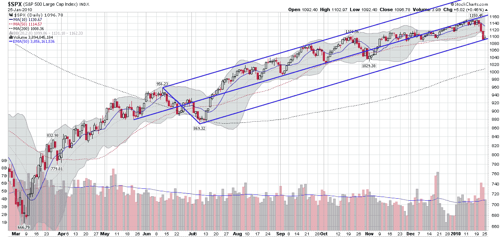

<!--yml

分类：未分类

日期：2024-05-18 17:17:13

-->

# VIX and More: Charting the Selloff with an Andrews Pitchfork

> 来源：[`vixandmore.blogspot.com/2010/01/charting-selloff-with-andrews-pitchfork.html#0001-01-01`](http://vixandmore.blogspot.com/2010/01/charting-selloff-with-andrews-pitchfork.html#0001-01-01)

在昨天的[The SPX and an 85 Day Moving Average](http://vixandmore.blogspot.com/2010/01/spx-and-85-day-moving-average.html)中，我详细介绍了定制移动平均线的使用，这些移动平均线是通过逆向工程设计的，以便精确地限定过去的股价动作。

经过一些尝试和错误，可以制作一个适合先前回调的移动平均线，正如 85 天移动平均线和标普 500 指数（SPX）自去年五月份以来的价格动作情况。

然而，碰巧的是，一个现成的图表工具，称为[安德鲁斯叉线](http://vixandmore.blogspot.com/search/label/Andrews%20Pitchfork)，在同一时期精确地捕捉了价格动作，并且还识别了一个价格通道和趋势线，这两个线在过去的八个月里一直是关键的支撑和阻力水平。

在下面的图表中，你可以看到，安德鲁斯叉线（以 Alan Andrews 命名）是通过从某个枢轴点（我使用的是 2009 年 5 月周期低点）开始，然后延伸一条线到下一个周期的高点和低点的中点（在这里，我使用的是迄今为止最大的回调，即 2009 年 6 月到 7 月的 9.1%的跌幅）创建的。这条线，即三条平行的蓝色线中的中间一条，安德鲁斯称之为中线。两侧的平行线（“叉线”）是通过将周期高点与低点之间的距离向前延伸时间创建的。结果建立了一个趋势通道和中线。

请注意，安德鲁斯叉线（Andrews Pitchfork）中的三条线在过去八个月中都是重要的支撑或阻力水平。叉线显示，截至十月底，标普 500 指数（SPX）在 中线和上叉线之间狭窄的范围内波动，上叉线起到了通道阻力作用。自去年十二月底跌破中线以来，标普 500 指数（SPX）一直徘徊在中线下方，直到上周市场暴跌，此时标普 500 指数（SPX）迅速下跌至下叉线。到目前为止，下叉线充当了支撑角色，这加强了三月份和七月份股价动作构建的安杜鲁斯叉线价值。

当然，叉线还显示了过去一周多时间内多头动量的减弱和开始逆转的程度。再有一次剧烈的突破，并且标普 500 指数（SPX）收盘价低于 1090 点，很可能会发出当前多头趋势结束的信号——至少在安德鲁斯叉线的术语中。

关于相关主题，读者们可以查阅：

*[source: StockCharts]*

***披露：*** *无*
