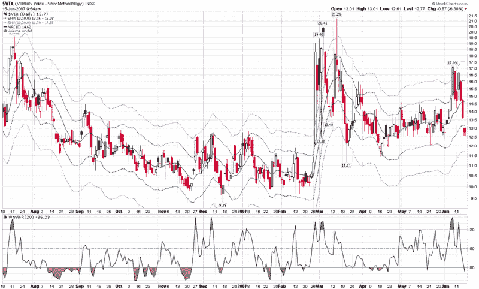

<!--yml

分类：未分类

日期：2024-05-18 19:10:47

-->

# VIX and More: 用 10 日 SMA 包线绘制 VIX

> 来源：[`vixandmore.blogspot.com/2007/06/charting-vix-with-10-day-sma-envelopes.html#0001-01-01`](http://vixandmore.blogspot.com/2007/06/charting-vix-with-10-day-sma-envelopes.html#0001-01-01)

虽然 VIX 目前正在经历看起来像是一次小型的[崩溃](http://vixandmore.blogspot.com/2007/06/vix-implosion-ahead.html)，但我想这可能是一个很好的时间，提供可能追踪 VIX 的最佳单一图表。

为了理解我的观点，我应该事先说明，我认为 10 日和 20 日简单移动平均是观察 VIX 数据最重要的两组数据——并且是短期[均值回归](http://vixandmore.blogspot.com/search/label/mean%20reversion)分析的基石。在这两个 SMA 中，我稍微偏爱 10 日 SMA 一点。

当然，你可以很容易地把 10 日 SMA 和 20 日 SMA 放在同一个图表上，但更有用的是要知道 VIX 偏离这些移动平均值有多远。为了快速检查这一点，我建议使用[移动平均包线](http://stockcharts.com/school/doku.php?id=chart_school:technical_indicators:moving_average_envelopes)，如图表下所示。你可以通过上一句中的链接了解 StockCharts 如何描述这些包线，或者只需考虑它们如何与[Bollinger Bands](http://vixandmore.blogspot.com/2007/06/vix-and-bollinger-bands.html)类似，不同的是，移动平均包线不是使用标准差作为衡量带线上下方均值宽度的测量工具，而是使用简单移动平均的固定百分比。

一个例子可以帮助说明问题。在下面的图表中，10 日 SMA（均值）用一条实蓝线表示，当前值为 14.62。当前值为 16.08 的 10%上轨用绿色虚线表示，而当前值为 17.55 的 20%上轨用紫色虚线表示。类似的模式也出现在下轨。

关于移动平均包线，有几点非常重要。首先，与 Bollinger Bands 或其他基于标准差的计算不同，它们*不*反映任何类型的波动性。相反，它们的宽度完全取决于基础简单移动平均（SMA）的值，而与波动性无关。其次，20%的带线很少被违反，通常代表非常好的均值回归设置；10%的带线被违反的频率更高，但同样提供了许多好的均值回归设置。

虽然观察和分析 VIX 有很多方法，但在我看来，移动平均包线是图表交易者手中最好的工具之一。

