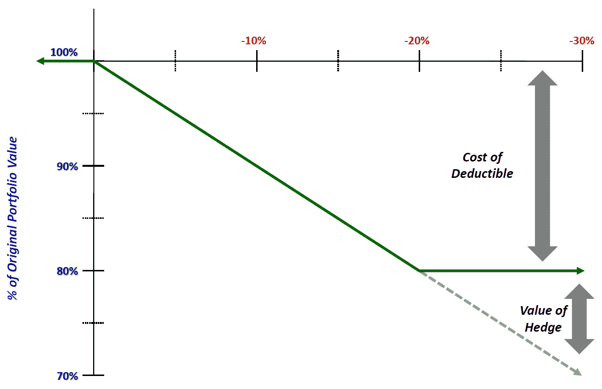
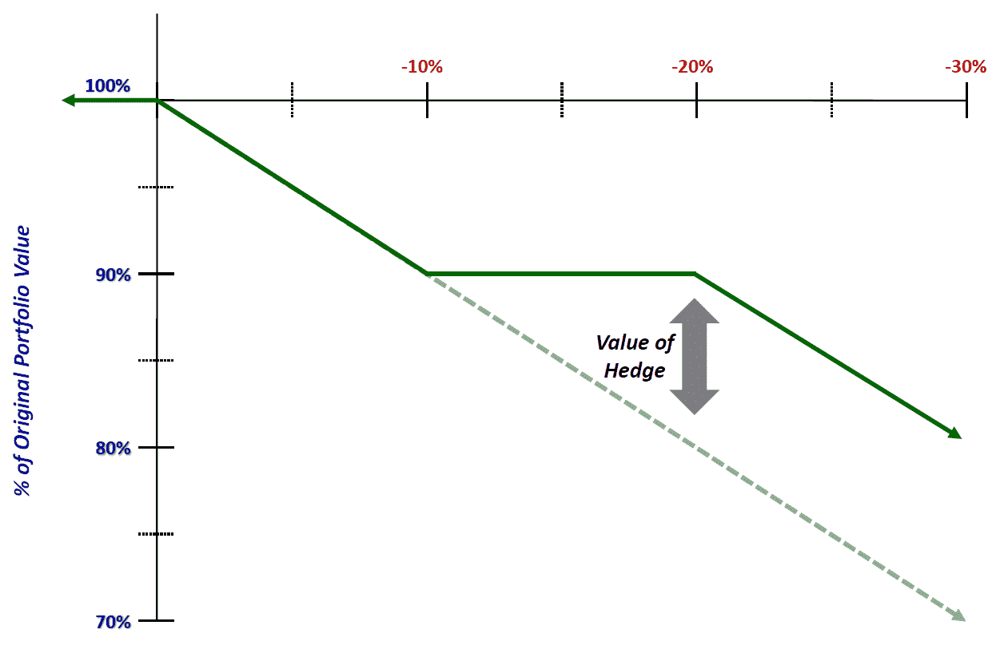
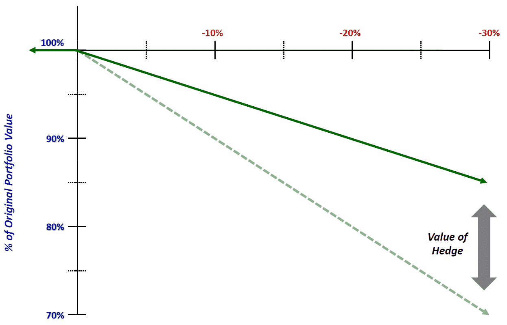

<!--yml

类别：未分类

日期：2024-05-18 16:30:11

-->

# VIX 和更多：使用部分对冲进行欺诈

> 来源：[`vixandmore.blogspot.com/2012/05/cheating-with-partial-hedges.html#0001-01-01`](http://vixandmore.blogspot.com/2012/05/cheating-with-partial-hedges.html#0001-01-01)

*[以下内容首次出现在 2011 年 5 月的《Expiring Monthly: The Option Traders Journal》杂志上。（http://www.expiringmonthly.com/）。我之所以分享它，是因为我收到了很多积极的反馈，以及最近收到了很多关于对冲的问题。]*

在经历了两年多的上涨牛市之后，看到主要股市指数翻了一番以上，并不令人惊讶的是，许多投资者开始更加关心保护现有利润，而不是寻找增加现有账户余额的方法。

作为一名靠交易期权为生的人，你可能会认为现在找到一种使用期权对冲我的投资组合的方法应该是轻而易举的。事实上，我一直更注重进攻而非防守，并不是因为我低估了风险管理的重要性，而是因为我通常认为投资组合保护的机会成本太高。我敢肯定这对于一些人来说听起来就像异端邪说，但事实是，我永远不想为投资组合保护支付全额价格，因此我在对冲投资组合方面的努力一直强调为我找到最窄的对冲，并将对冲成本降至最低。简而言之，我的方法是试图找出在哪里剪角和削减赔率，而不显著增加我的风险敞口。学者可能会称这为创建定制或个性化的对冲。我更愿意用通俗的话来说，就是欺诈赔率。带着以上的想法，本文的其余部分试图解释我如何看待构建定制部分对冲的方法。

**三种对冲方法**

首先，我对限制我的上行潜力的对冲不感兴趣。为此，我通常避免使用止损，除非我要去度假，并且不打算关注市场。

我发现以下三种对冲策略最具吸引力：

> 1) *灾难保护对冲* – 在达到特定跌幅阈值（如 10%或 20%）后才支付的对冲，类似于带有大额免赔额的保险合同
> 
> 2) *缺口保护对冲* – 具备灾难保护对冲的所有特点，同时还包括一个上限，结果是只有在特定的范围内（如 10% - 20%的跌幅）对冲才会生效
> 
> 3) *成比例保护对冲* – 不是使用阈值和上限，而成比例保护为每个美元损失的固定百分比提供保险

上述三种套保策略的共通之处在于，投资者选择了部分保护而非完全保护，这是基于他对损失可接受的风险程度的评估以及为了保留交易资本而必须对多少损失进行对冲。

在描述三种套保类型时，我采用了与保险行业通常相关的术语，以帮助阐明一些重要概念。具体来说，我使用“免赔额”这一术语来描述组合中未对冲的部分，因此完全处于风险中。如图 1 所示，在灾难保护套保的情况下，免赔额等于未对冲的损失的前 20%，在触发保险阈值之前。用期权术语来说，图 1 的例子相当于持有 SPY 130 的长期多头仓位，并通过持有 SPY 104 的看跌期权对冲该仓位，因为 104 = 130 * 80%。

图 1：灾难保护套保在保险生效前对 80%的组合进行保护，免赔额为 20%（来源：VIX 和更多）

尽管每位投资者都应该深入思考如何对冲股票的大幅下跌，例如 2008 年的情况，但实际上百年一遇的洪水并不经常发生，并且每天维持这种对冲可能会非常昂贵。因此，我喜欢我称之为“缺口保护套保”的想法。如图 2 所示，投资者可能认为股票不太可能下跌 20%或更多，因此他或她可能更愿意对 10%的下跌（即 10%的免赔额）保持未保护，但对于从 10%到 20%的任何损失，都要进行等额的对冲。这种套保的最大好处被限制在 20%，因此一旦损失开始超过 20%，投资者将完全暴露于任何额外的损失中。在期权世界里，这种保护类似于持有 SPY 130 的长期多头仓位，并对冲为持有 SPY 117 的看跌期权和等额的 SPY 104 看跌期权空头仓位。

图 2：缺口保护套保仅针对特定范围，此处从 10%到 20%（10%免赔额，20%上限）（来源：VIX 和更多）

虽然我认为从免赔额和最大利益上限的角度来考虑对冲是有帮助的，但比例保护的好处在于其简单性。在保险术语上，这在某些方面类似于共同支付。如图 3 所示，比例保护没有免赔额或上限，保险覆盖从第一美元的损失开始。此示例显示了 50%比例保护在图形形式的外观。在此例中，股市下跌 20%只会因为对冲的部分抵消而造成 10%的损失。在下面的示例中，这种策略的期权等价物可能是持有 1000 股 SPY，并通过 5 份平值看跌期权进行对冲。当然，由于 SPY 期权的合约乘数是 100 股，因此可以用 10 份看跌期权完全对冲 1000 股，这意味着 5 份看跌期权将代表 50%的对冲。

图 3：**比例保护立即开始，但仅涵盖损失的一定比例（想想 50%的共同支付）（来源：VIX 和更多）**

**结合多种对冲方法**

虽然一些投资者可能会满足于只采用上述三种部分对冲策略中的一种，但当您将这些对冲看作是构建模块，允许投资者设计定制对冲时，真正的乐趣才刚刚开始。

例如，假设一个人可以接受前 10%的回调作为业务成本，并愿意在组合损失的前 10%保持未对冲。在某个时候，投资者可能会希望对冲开始抵消一部分额外损失，但仍然认为保护成本过高，不值得在 10%或 20%的回调时进行全面覆盖。这位投资者可能还认为股票不太可能下跌超过 30%，但可能不想让他的或她的组合遭受超过 20%的损失。

满足这些所有要求的一种对冲结构可能是购买从 10%到 20%的股票市场损失的缺口保护，购买 50%的比例保护以覆盖从 20%到 30%的损失，并在损失超过 30%的事件中依赖灾难保险。在这里，总最大损失为 20%（前 10%和接下来 20%的 50%），并且对冲结构如此，投资者为最昂贵的保险（前 10%）支付 nothing，为接下来最昂贵的保险（接下来 20%的比例保险）获得折扣，只为最不可能的事件支付全价，即市场跌幅超过 30%。

**结论**

不可否认，对冲成本很高，特别是对于那些更相信自己的交易技巧而非对冲技巧的人来说。然而，就像任何高空走钢丝表演一样，成功的交易员需要一个安全网，以允许他们执行复杂和危险的动作。

能够将自己的风险承受力用最坏情况下的情景和潜在的最大回撤来定义的交易者，有许多方法可以构建对冲头寸以限制其风险。本文突出了构建部分对冲的三种不同方法，旨在最大化投资组合的保护，同时最小化这些对冲的成本以及某些类型的风险的规模。通过结合这些不同的部分对冲策略，交易者可以定制自己的风险敞口以满足个人需求，并确保可以以尽可能高效的方式构建适当的对冲。

相关文章：

***披露(s):*** *我是《Expiring Monthly》的创始人之一和所有者*
