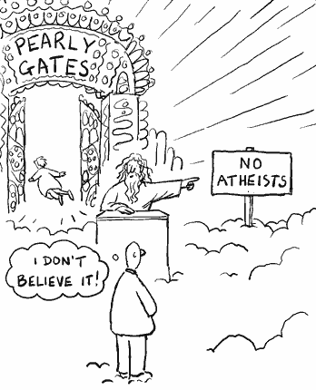

<!--yml

分类：未分类

日期：2024-05-18 18:47:25

-->

# 股市 VIX 与更多：检查无神论者

> 来源：[`vixandmore.blogspot.com/2008/01/checking-for-atheists.html#0001-01-01`](http://vixandmore.blogspot.com/2008/01/checking-for-atheists.html#0001-01-01)

当我看到市场反弹时，我喜欢做的一件事就是我所说的“无神论者检查”。本质上，我会查看[ISEE](http://vixandmore.blogspot.com/search/label/ISEE)的当前和近期数字，以查看是否有许多信徒正在涌入购买看涨期权。数字越低，仍然存在的无神论者就越多（如果你喜欢用政治隐喻而不是宗教隐喻，那就是“未决定者”），因此潜在的皈依者就越多。逆向投资者喜欢潜在的皈依者，因为它们是后续牛市阶段的未来动力。通常，当我看到 ISEE 数字（他们使用看涨/看跌比率，而不是 CBOE 所使用的看跌/看涨比率）低于 120 时，我认为这是一个看涨信号。ISEE 低于 100，表示开设新的看跌期权多于看涨期权的人越多，就越看涨。

通常，ISEE 低于 100 的情况相对罕见，特别是在长期内。我发现当前市场值得注意的是，ISEE 在过去六天中的五天收盘价低于 100，今天东部时间下午 12:50 的 92，有望实现七天内六次。自交易所 2002 年 10 月开始记录以来，ISEE 在连续七天内六次收盘价低于 100 的唯一其他时间是[2007 年 8 月](http://vixandmore.blogspot.com/2007_08_01_archive.html)，这是由第一次次贷危机引发的抛售触底时。

在我看来，目前的 ISEE 数据几乎和去年 8 月出现的 37.50 VIX 跳涨一样引人注目。虽然 VIX 显示了无神论者的恐惧，但 ISEE 揭示了他们的数量，这让我想起了我最喜欢的一句话，这句话来自约翰·本德，出现在杰克·施瓦格的《股市巫师》（[Stock Market Wizards](http://www.amazon.com/Stock-Market-Wizards-Interviews-Americas/dp/0066620597)）中，“*重要的不是人们对股票的当前看法，而是看法的潜在改变。*”
