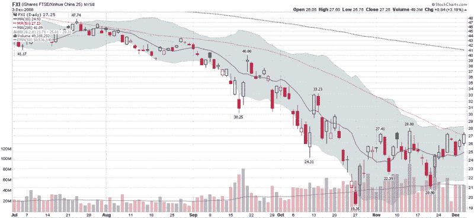

<!--yml

分类：未分类

日期：2024-05-18 18:12:36

-->

# VIX and More: 中国即将突破？

> 来源：[`vixandmore.blogspot.com/2008/12/china-about-to-break-out.html#0001-01-01`](http://vixandmore.blogspot.com/2008/12/china-about-to-break-out.html#0001-01-01)

就在十天前，我还认为我的早期预测关于[中国](http://vixandmore.blogspot.com/search/label/China)的[是具有挑衅性的](http://vixandmore.blogspot.com/2008/11/time-to-be-long-china.html)。自那时以来，原本可能出现的下行动量的暂停已经明显变得更加看涨，FXI 又上涨了 10%。

下面的图表显示了[FXI](http://vixandmore.blogspot.com/search/label/FXI)，即 iShares FTSE/Xinhua China 25 Index ETF，在前天首次收盘于 50 日简单移动平均线（SMA）之上。自 FXI 触底以来已经过去了 27 个交易日。自那时以来，中国 ETF 从触底位置反弹了超过 40%。

如果 FXI 今天再次收盘于其 50 日移动平均线之上，这将是 FXI 在过去六个月中首次连续几天收盘于这一重要的技术水平之上。今天开盘十分钟后，FXI 的交易价格为 26.70，下跌了 0.55。由于 50 日 SMA 位于 26.94，任何收盘于 27.00 或以上的价格都应该在图表上留下相对看涨的信号，并支持增加上行动量的案例。

*[来源：StockCharts]*
