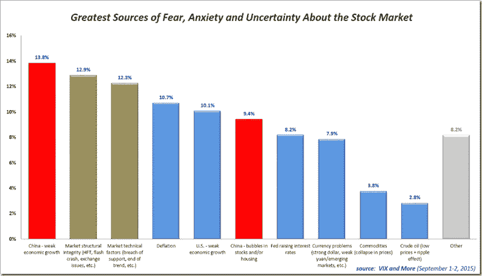

<!--yml

分类：未分类

日期：2024-05-18 16:08:49

-->

# VIX 和更多：中国增长和市场结构完整性成为恐惧调查担忧的首要列表

> 来源：[`vixandmore.blogspot.com/2015/09/china-growth-and-market-structural.html#0001-01-01`](http://vixandmore.blogspot.com/2015/09/china-growth-and-market-structural.html#0001-01-01)

在几乎一年的停顿（具体是 2014 年 10 月的回调）之后，我重新推出了[VIX 和更多恐惧调查](http://vixandmore.blogspot.com/search/label/Fear%20poll)，试图深入了解哪些问题导致了投资方程中的恐惧回归，并因此触发了自[2008](http://vixandmore.blogspot.com/search/label/2008)-09 金融危机以来最高的 VIX 跳升（53.29）以及连续两天的第 5 和第 6 单日[VIX 跳升](http://vixandmore.blogspot.com/search/label/VIX%20spikes)记录。

在下面的图表中，我总结了过去两天来自近 400 名选民、覆盖 40 个国家的 top ten 回应。问题是：“以下哪一项会让你对股市感到最恐惧、焦虑或不确定的？”

数据来源：[VIX 和更多](http://vixandmore.blogspot.com/2015/09/china-growth-and-market-structural.html#0001-01-01)

我应该指出，周二的结果将“市场结构完整性（高频交易、闪崩、交易所稳定性等）”列为头号担忧，但今天晚些时候对于“[中国](http://vixandmore.blogspot.com/search/label/China)——经济增长放缓”的投票激增，使中国担忧超过了一切。将中国增长担忧与对中国股市和/或房地产泡沫的担忧相结合，使得支持中国所有问题的 landslide。不太牵强的话，也可以把像[货币](http://vixandmore.blogspot.com/search/label/currencies)问题、通缩、低[原油](http://vixandmore.blogspot.com/search/label/crude%20oil)价格和下跌[大宗商品](http://vixandmore.blogspot.com/search/label/commodities)价格一股脑儿扔进更广泛的中国相关篮子里，突然之间，中国+涟漪效应占据了大约 50%的选票。

正如往常一样，我很喜欢看到美国人对世界的看法与其他非美国受访者形成的对比。这一次，美国人在其他国家和地区的人眼中过分强调的领域是，以典型的美国中心主义近视眼方式……“美国——经济增长疲软”，有 8.7%的美国人将其列为他们最关心的问题，而非美国同龄人。相反，对于美国人来说，至少相对于其他国家人的担忧来说，最大的盲点是商品价格，美国人对其重视程度低了 5.1%。在美国近视眼大赛中，紧随其后的是中国股市和/或房地产的泡沫。我不觉得商品价格的忽视令人惊讶，但相对较低的关注中国泡沫确实出人意料。

对于那些还没有看到这次民意调查早期版本的人，这些数据可以追溯到 2012 年，记录了一个如此着迷于[财政悬崖](http://vixandmore.blogspot.com/search/label/fiscal%20cliff)的美国公众，以至于他们没有充分认识到[欧洲主权债务危机](http://vixandmore.blogspot.com/search/label/European%20sovereign%20debt%20crisis)的严重性。

相关文章：

***披露信息：*** *无*
