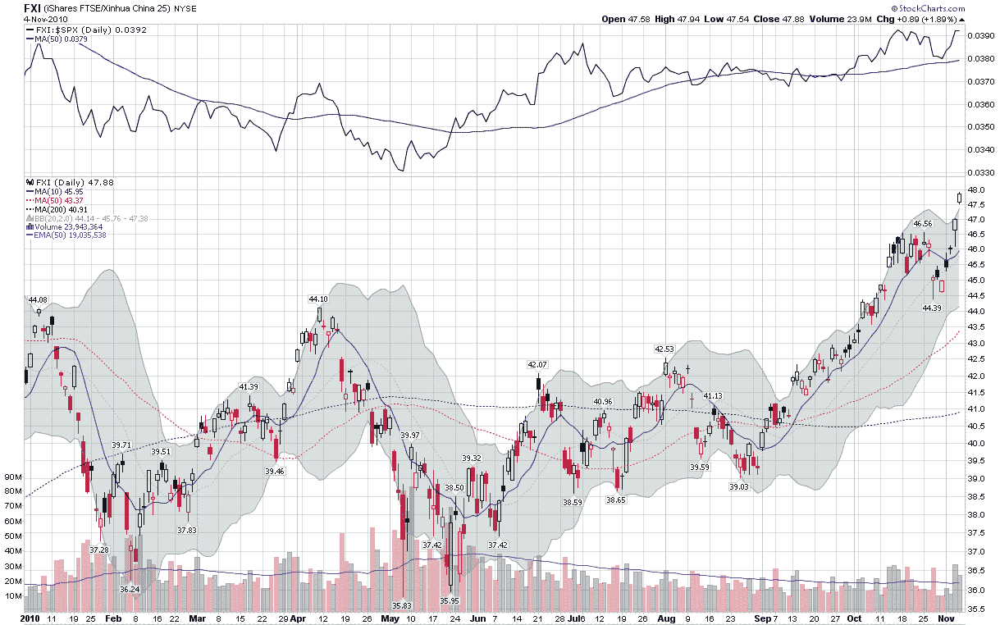

<!--yml

分类: 未分类

日期: 2024-05-18 16:59:30

-->

# VIX and More: 中国股市击败美国同行

> 来源：[`vixandmore.blogspot.com/2010/11/chinese-stocks-thump-us-counterparts.html#0001-01-01`](http://vixandmore.blogspot.com/2010/11/chinese-stocks-thump-us-counterparts.html#0001-01-01)

在量化宽松和选举的讨论中，很容易采取（或继续坚持）以美国为中心的投资世界观。

然而，事实是，近期在[中国](http://vixandmore.blogspot.com/search/label/China)的牛市对美国造成的损害要大得多。

下面的图表显示了[FXI](http://vixandmore.blogspot.com/search/label/FXI)，即[iShares FTSE/Xinhua China 25 Index](http://www.ishares.com/product_info/fund/overview/FXI.htm)在 2010 年的表现。注意，虽然本周标普 500 创下新的 2010 年高点引起了很大关注，但 FXI 自 10 月初以来反复创下年内新高，目前已比之前的高点高出约 10%。

请注意，在相对表现（顶级研究）方面，FXI 自 5 月 6 日的大盘暴跌以来一直超越标普 500 指数。

我之前曾谈到过，将中国视为美国股市可能的领先指标。近期数据显示，投资者可能需要更加关注中国股市的前瞻性力量，并重新调整他们的地理偏见。

相关文章：

***披露(s):*** *在撰写本文时持有 FXI*

**[来源：StockCharts.com]**
