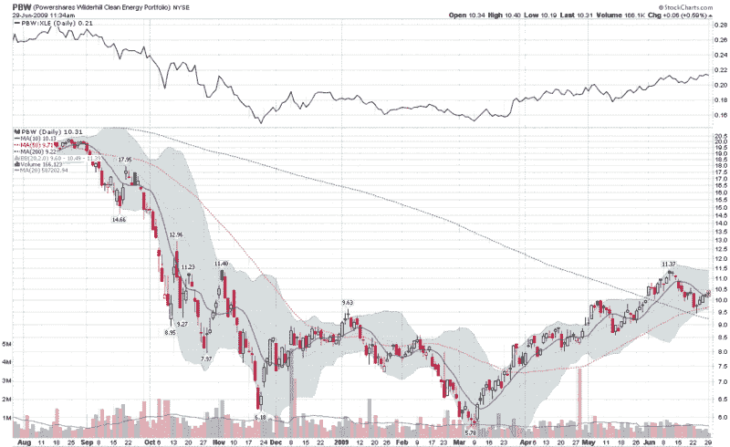

```

类别：未分类

日期：2024-05-18 17:40:51

```

# VIX and More: Clean vs. Not-So-Clean Energy

> 来源：[`vixandmore.blogspot.com/2009/06/clean-vs-not-so-clean-energy.html#0001-01-01`](http://vixandmore.blogspot.com/2009/06/clean-vs-not-so-clean-energy.html#0001-01-01)

虽然我在博客上没有提过很多，但我最喜欢投资的行业之一就是能源行业。说到能源 ETF，重量级选手就是[XLE](http://vixandmore.blogspot.com/search/label/XLE)，能源精选行业 SPDR，平均每天交易超过 2000 万股。XLE 的持仓严重倾向于主要综合性石油公司，埃克森美孚([XOM](http://vixandmore.blogspot.com/search/label/XOM))和雪佛龙([CVX](http://vixandmore.blogspot.com/search/label/CVX))的持仓占比超过 ETF 持仓的 1/3，随后是康菲石油([COP](http://vixandmore.blogspot.com/search/label/COP))、斯伦贝谢([SLB](http://vixandmore.blogspot.com/search/label/SLB))、西方石油([OXY](http://vixandmore.blogspot.com/search/label/OXY))等。

随着周末期间碳交易立法在众议院通过，投资能源领域变得更加有趣。XLE 今日上涨，热门石油服务 ETF[OIH](http://vixandmore.blogspot.com/search/label/OIH)（前五大持仓股青睐钻探公司，包括[RIG](http://vixandmore.blogspot.com/search/label/RIG)、[SLB](http://vixandmore.blogspot.com/search/label/SLB)、[DO](http://vixandmore.blogspot.com/search/label/DO)、[BHI](http://vixandmore.blogspot.com/search/label/BHI)和[NE](http://vixandmore.blogspot.com/search/label/NE))和勘探生产 ETF[XOP](http://vixandmore.blogspot.com/search/label/XOP)（前五大持仓股为[XEC](http://vixandmore.blogspot.com/search/label/XEC)、[PXD](http://vixandmore.blogspot.com/search/label/PXD)、[EAC](http://vixandmore.blogspot.com/search/label/EAC)、[INT](http://vixandmore.blogspot.com/search/label/INT)和[HK](http://vixandmore.blogspot.com/search/label/HK)。)

在清洁能源/绿色领域的 ETF 有很多。或许这些中最为人所知且最受欢迎的是 PowerShares WilderHill Clean Energy([PBW](http://vixandmore.blogspot.com/search/label/PBW))，其最大的持股公司包括太阳能公司（前五大持股公司为[FSYS](http://vixandmore.blogspot.com/search/label/FSYS), [VLNC](http://vixandmore.blogspot.com/search/label/VLNC), [SOLR](http://vixandmore.blogspot.com/search/label/SOLR), [ESLR](http://vixandmore.blogspot.com/search/label/ESLR), [SOL](http://vixandmore.blogspot.com/search/label/SOL)。)更有趣的替代品是其姊妹 ETF，PowerShares WilderHill Progressive Energy([PUW](http://vixandmore.blogspot.com/search/label/PUW))，它更加重视能源效率和核能，并且其前五大持股公司包括 MX.TO, [ES](http://vixandmore.blogspot.com/search/label/ES), [PX](http://vixandmore.blogspot.com/search/label/PX), [USU](http://vixandmore.blogspot.com/search/label/USU) 和 CCO.TO。对于只太阳能 ETF 投资，Claymore/MAC 全球太阳能能源([TAN](http://vixandmore.blogspot.com/search/label/TAN))是一个极好的选择。请注意，TAN 的许多持股在美国交易所没有交易。目前的五大持股是 MBTN.SW, [FSLR](http://vixandmore.blogspot.com/search/label/FSLR), S92.BE, CTN.DU 和 SWV.BE。在前十大持股中还有两家中国太阳能公司，其 ADRs 在美国可用：[STP](http://vixandmore.blogspot.com/search/label/STP) 和 [TSL](http://vixandmore.blogspot.com/search/label/TSL)。

在下面的图表中，我突出显示了我最喜欢的全用途清洁能源 ETF，PBW，并包括了 PBW 与 XLE 的比率，以了解清洁能源相对于整个能源部门的相对表现。尽管在过去的三周里，PBW 随着 broader market 回调，但它继续相对于广泛的能源部门 ETF 表现强劲。正如比率图表暗示的那样，涉及清洁能源 ETF（如 PBW、PUW 和 TAN）与 XLE、XOP 和 OIH 之间的配对交易是未来玩华盛顿能源立法游戏的一种方式。



**来源：[StockCharts]**

**声明**：在撰写本文时，我持有 OIH、DO、INT 和 TSL 的长期投资。
