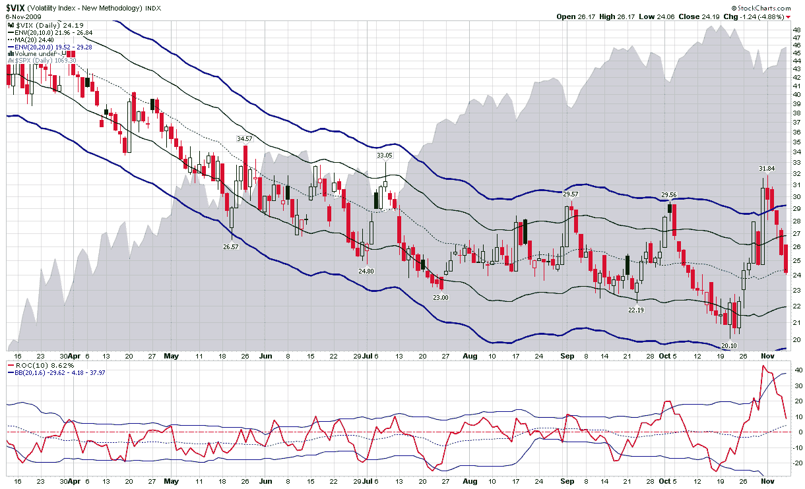

<!--yml

分类：未分类

日期：2024-05-18 17:23:16

-->

# VIX 和更多内容：结合 Bollinger 带和 VIX 的变化率

> 来源：[`vixandmore.blogspot.com/2009/11/combining-bollinger-bands-on-rates-of.html#0001-01-01`](http://vixandmore.blogspot.com/2009/11/combining-bollinger-bands-on-rates-of.html#0001-01-01)

据我所知，我还没有发布过关于如何使用[Bollinger bands](http://vixandmore.blogspot.com/search/label/Bollinger%20bands)与[变化率](http://vixandmore.blogspot.com/search/label/rate%20of%20change)（ROC）指标相结合来识别波动率突破的内容。

在总结过去两周 VIX 的行动时，下面的图表捕捉了 10%（实心绿色）和 20%（实心蓝色）[移动平均包络](http://vixandmore.blogspot.com/search/label/moving%20average%20envelopes)的一些戏剧性情况。在图表中包含的六个月时间框架内，移动平均包络上周的[VIX 尖峰](http://vixandmore.blogspot.com/search/label/VIX%20spikes)标记为自 3 月份股市反弹以来最强烈的。移动平均值还表明，三周前的 VIX 低点 20.10 是突破下移动平均包络的第二强点。

下面的主要图表下面的研究使用了 10 天的变化率函数以及调整至 20 天和 1.6 个标准差的 Bollinger 带。注意在这个研究中，VIX 的尖峰和先前的 VIX 低点相对于 Bollinger 带代表了最大的上升和下降幅度。

变化率指标是一种有价值的方式来衡量剧烈的价格变动。当与 Bollinger 带指标结合时，可以更好地识别剧烈的上升和下降变动，特别是当基础资产习惯于突然发生大幅变动时，正如 VIX 的情况。

为了查看与相关主题的其他文章，读者可以查看：

来源：[StockCharts]
