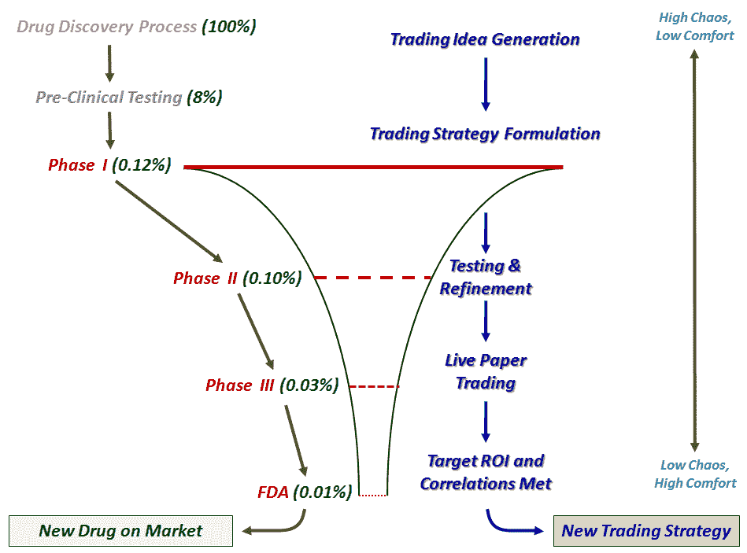

<!--yml

分类：未分类

日期：2024-05-18 17:29:20

-->

# VIX 和更多：舒适区、关注和生物技术公司的思维方式

> 来源：[`vixandmore.blogspot.com/2009/09/comfort-zones-focus-and-thinking-like.html#0001-01-01`](http://vixandmore.blogspot.com/2009/09/comfort-zones-focus-and-thinking-like.html#0001-01-01)

在周三的帖子《卡夫卡、超现实主义与交易》中，我谈到了摆脱舒适区以提高交易的重要性。一位读者表示担忧，认为过于追求突破舒适区是一种昂贵教训的学习方式，可能是一种邀请灾难的方法。

读者提出了很好的观点，所以让我进一步阐述并阐明我的想法。

考虑将生物技术公司作为交易和特别是交易策略开发的隐喻。生物技术公司管理着处于开发阶段的药物管线，在许多情况下，还拥有在市场上产生收入的药物。将管线中的药物视为与交易者仍在孵化、测试并决定是否足以用交易资本实施的交易想法相似。

对于处于研发阶段的药物，在药物被测试有效性和副作用之前，需要经历各种开发阶段。随着药物沿着研发管线进展，它们要通过正式称为第一阶段、第二阶段和第三阶段的内部审批流程，最终通过 FDA 的最终审批流程，确定药物是否可以向公众销售。只有很小一部分（大约 8%）的潜在新药想法能够进入前期临床试验，不到 1%的药物被认为足够值得进行第一阶段试验所需的投入。随着药物在每个试验阶段的末端遇到审批流程，具有高潜力的候选药物数量不断减少，因为与有效性或副作用相关的问题要受到严格的统计分析。随着这些药物沿着研发管线进展，财务投资显著增加。最终，大约只有 1/10,000 的原始药物能够一路进展到 FDA 批准，并最终上市。平均而言，整个过程需要大约十年时间。

投资者应该将他们的投资想法和策略也看作是一个管道管理过程。有限的资本可供使用，只有最好的策略才应该得到资助。在管道的最初阶段，投资者应该最关注的是走出他们的舒适区，制定大胆的新交易想法，并将这些想法转化为可操作的策略。这是离开舒适区，拥抱一些混乱的最佳时机。当这些想法经过某种内部审批流程后，关注点就变得更加重要了。这个想法健壮吗？这个想法可以转化为有效的策略吗？有足够的流动性来实施这些策略吗？滑点成本会是多少？初步回测结果在潜力方面显示了什么？等等。

当新的想法通过内部审批流程时，交易员应该从不适区域转移到极度舒适区域。等到一个交易策略准备部署时，交易员的心态应该已经从高混乱低舒适转变为低/无混乱高舒适。我在下面的图表中概述的交易想法开发过程的一个推论是，如果一个人在交易想法管道的最初阶段能够更好地离开他们的舒适区，那么交易结果会更好，当想法生成的混乱被转化为关注策略时，更有可能出现不相关的策略。

关于交易策略开发，有四个非常优秀的博客值得关注：

