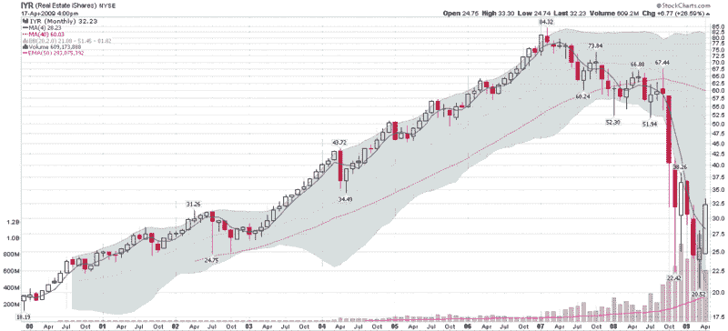

<!--yml

类别：未分类

日期：2024-05-18 17:51:12

-->

# VIX 和更多：商业房地产问题堆积如山

> 来源：[`vixandmore.blogspot.com/2009/04/commercial-real-estate-problems-piling.html#0001-01-01`](http://vixandmore.blogspot.com/2009/04/commercial-real-estate-problems-piling.html#0001-01-01)

尽管在博客上很少提及，房地产恰好是我最喜欢的资产类别之一。它是波动的，可以高度杠杆化，同时也提供了我所说的“使用价值”，这意味着它不仅仅是你希望增值的一张纸，也可以是你可以从中获得一些乐趣的有形财产。同样的原因，我更愿意在墙上挂一幅[米罗](http://fundaciomiro-bcn.org/index.php?idioma=2)的画而不是在艺术 ETF 上的投资。

回到房地产市场，我在[等待下一只鞋掉落](http://vixandmore.blogspot.com/2009/04/waiting-for-next-shoe-to-drop.html)一文中理论化地认为，信用卡债务或[商业房地产](http://vixandmore.blogspot.com/search/label/commercial%20real%20estate)最有可能是引发下一次金融危机的候选人。

穆迪[最近报告](http://www.reuters.com/article/companyNewsAndPR/idUSN0150570720090401)称，美国信用卡违约率在 2 月份升至 8.82%，创历史新高，并指出他们预计违约率将在 2010 年上半年达到 10.5%的峰值。

商业房地产的定时炸弹甚至可能带来更严重的后果，因为商业房地产价格在未来几年持续下跌。一周前，Fil Zucchi 在 Minyanville 很好地解释了商业房地产的问题：[商业房地产的回归？](http://www.minyanville.com/articles/4/13/2009/index/a/22149)，今天他带来了后续文章[十个商业房地产不会反弹的理由](http://www.minyanville.com/articles/4/20/2009/index/a/22256)。

有很多玩法可以投资房地产。双倍 ETFs，[URE](http://vixandmore.blogspot.com/search/label/URE) (+2x)和[SRS](http://vixandmore.blogspot.com/search/label/SRS) (-2x) 是寻找交易工具的好地方。对于非杠杆化玩法，[IYR](http://vixandmore.blogspot.com/search/label/IYR) 提供最佳流动性和活跃的期权市场。鉴于房地产股票最近的反弹力度（如图表所示，从近期底部上涨了 50%以上），在我对商业房地产故事的进展有更好的了解之前，我会至少倾向于做空。

*[来源：StockCharts]*

****披露****：撰写本文时持有 IYR 的空头仓位。**
