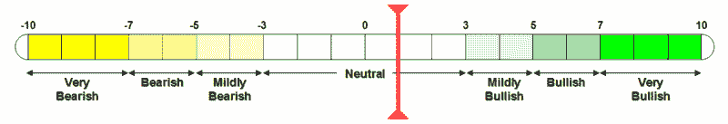

<!--yml

分类：未分类

日期：2024-05-18 15:52:33

-->

# VIX 和更多：自满情绪再次浮现；VWSI 为+1

> 来源：[`vixandmore.blogspot.com/2007/03/complacency-creeping-back-in-vwsi-at-1.html#0001-01-01`](http://vixandmore.blogspot.com/2007/03/complacency-creeping-back-in-vwsi-at-1.html#0001-01-01)

包括[Tim Knight](http://tradertim.blogspot.com/)在内的许多评论员指出，VIX 已经[扭转了 2/27 之后的所有波动](http://tradertim.blogspot.com/2007/03/give-past-slip.html)。尽管波动性指标比看跌/看涨比率下降得更快，但可以肯定的是，一些投资者认为短暂的市场调整已经过去，现在牛市可以安全地继续其路径。简而言之，一些自满情绪正在慢慢回到市场中。

VIX 周度情绪指标（VWSI）([VWSI](http://vixandmore.blogspot.com/search/label/VWSI))反映了这种自满情绪，因为它在过去几周内紧贴 0 点，目前为+1。

虽然 VWSI 通常试图预测未来 1-2 周内的 VIX 走势，但提醒读者现在正是回顾长期[季节性周期](http://vixandmore.blogspot.com/search/label/seasonality)的好时机。你可能从未听说过，“三月份卖出，然后离开”，但三月至六月的市场“V”形态的下跌周期正是我之前[评论过的](http://vixandmore.blogspot.com/2007/01/month-by-month-look-at-vix.html)。

我现在不会试图预测波动率的突然上升，但我预计在接下来的几周里我们还会看到几次更小的波动。更好的做法是，准备好稍微玩一下[抓娃娃](http://en.wikipedia.org/wiki/Whac-A-Mole)游戏，并在波动发生时平仓这些波动。

（请注意，在上述温度计中，“看涨”和“看跌”标签适用于 VIX，而不是更广泛的市场，后者通常与 VIX 呈负相关。）

葡萄酒搭配：不久前，一位读者大胆地建议我也许应该考虑为 VWSI 提供葡萄酒搭配。为什么不呢？我一直以来忽视了我的[葡萄酒博客](http://zinandpinot.blogspot.com/)，所以为什么不激发我们所有人潜在的葡萄酒爱好者。对于当前+1 阅读内容，经历了一些剧烈的波动后，迎来新季节，我推荐一款干型[格乌兹特拉米纳](http://www.epicurious.com/drinking/wine_dictionary/entry?id=6560)葡萄酒。格乌兹特拉米纳是一款能够经受住四季变化和各种波动水平的葡萄酒。它比其他任何白葡萄酒都有更强的个性，风格更多样...它不是霞多丽。虽然经典版本源自[阿尔萨斯](http://www.vinsalsace.com/en/)，但我非常喜欢这种葡萄酒的几款美国版本：干型；半干型；以及甜型。有一家酒庄完美掌握了这三种版本的酿造，那就是[Navarro](http://www.navarrowine.com/shop/productdetail.php?prodid=546)。然而，上周末，我在[俄罗斯河山谷](http://www.rrvw.org/)的[Harvest Moon](http://www.harvestmoonwinery.com/our-wines.html)发现了一款令人惊叹的干型格乌兹特拉米纳葡萄酒。我犹豫是否提到 Harvest Moon，因为它是一家很小的酒庄，但葡萄酒如此出色，它们应该拥有更广泛的受众。请享用！
