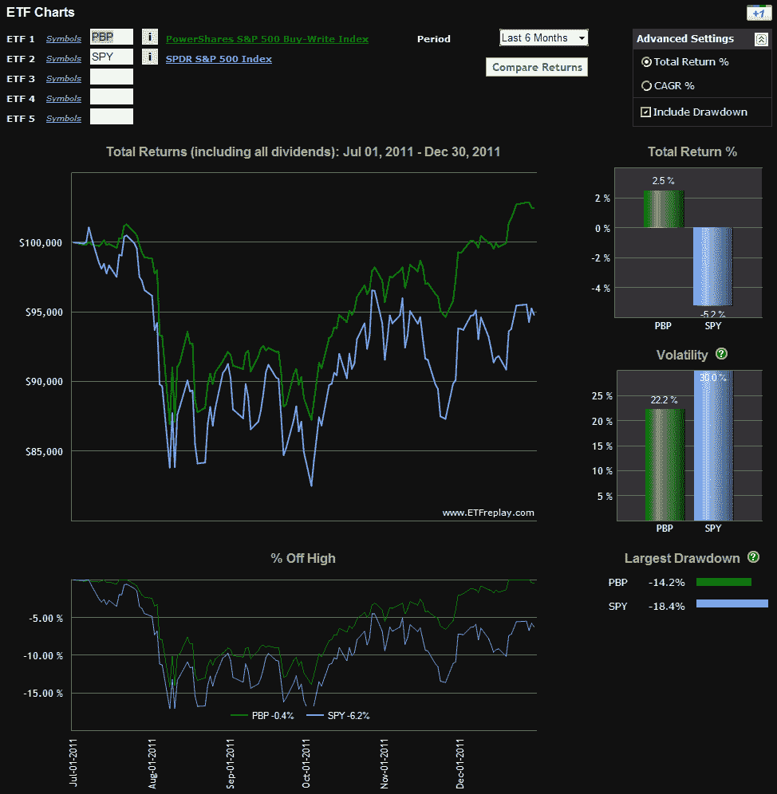

<!--yml

类别：未分类

日期：2024-05-18 16:44:14

-->

# VIX and More: Covered Calls Finish Strong in 2011

> 来源：[`vixandmore.blogspot.com/2012/01/covered-calls-finish-strong-in-2011.html#0001-01-01`](http://vixandmore.blogspot.com/2012/01/covered-calls-finish-strong-in-2011.html#0001-01-01)

只需回顾一下[VIX 和波动性的一年（2011 年）](http://vixandmore.blogspot.com/2012/01/year-in-vix-and-volatility-2011.html)就足以让人感到恶心。试图告诉一个有[恐高症](http://en.wikipedia.org/wiki/Acrophobia)的人，即使是最惊险的过山车最终也会回到起点，你可能不会减轻任何恐惧。对于徒步旅行者、骑车者或登山者来说，情况类似。他们需要付出的努力与他们最终到达与起始相同的海拔无关，而是与他们在整个路线、道路或山脉上的累计海拔上升有关。生活中许多事情都是关于旅程，而不是目的地。

对于那些可能有一点恐高症、希望他们的徒步旅行对他们的心血管系统造成的压力较小，并且希望他们的投资组合能反映出他们希望体验世界的方式的人来说，[覆盖式看涨期权](http://vixandmore.blogspot.com/search/label/covered%20calls)或[买入写策略](http://vixandmore.blogspot.com/search/label/buy-write)可能是个答案。我过去在这个空间里多次讨论过看涨期权和买入写策略的主题（见下面的链接），但本质上这是一种策略，它针对现有（覆盖式看涨期权）或新（买入写）的多头头寸卖出看涨期权，以产生来自基础资产的收入。如果股市下跌、横盘整理或缓慢上涨，看涨期权和买入写策略通常会优于 SPX/SPY。实现这些策略的成本是，如果市场出现急剧的看涨走势，收益会被看涨期权所限制。

在 ETP 领域，谈到买入写策略时，有两个选择：

+   PowerShares S&P 500 BuyWrite Portfolio ETF ([PBP](http://vixandmore.blogspot.com/search/label/PBP))

+   iPath CBOE S&P 500 BuyWrite Index ETN ([BWV](http://vixandmore.blogspot.com/search/label/BWV))

PBP 是这两个选择中更流动的一个，但一些投资者可能有自己的理由更喜欢 BWV 的方法和表现。

在下面的图表中，我记录了 2011 年下半年 PBP 与 SPY 的股指曲线。在此期间，股市总体上呈横向波动，波动性保持高位——为买入写策略量身定做的时期。注意，在这六个月里，PBP 的表现比 SPY 高出 7.7%，波动性显著较低，并且从峰值到谷值的回撤也较小……登山者可能会称之为累计海拔损失。

如果 2012 年高波动性持续存在，并且股票最终收于年初附近的位置，PBP 和 BWV 都可能再次跑赢主要市场指数。

相关文章：

*[来源：ETFreplay.com]*

**披露：**写作时持有 PBP；TradeKing 是 VIX 和 More 的广告商
