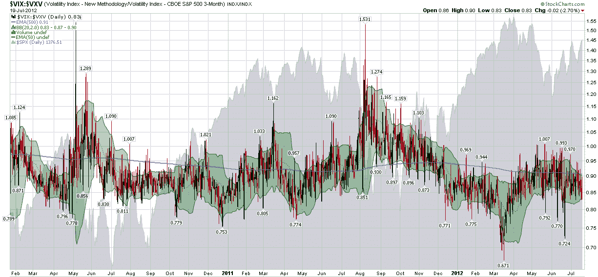

<!--yml

category: 未分类

date: 2024-05-18 16:25:55

-->

# VIX and More: Crazy VIX:VXV Ratio Chart

> 来源：[`vixandmore.blogspot.com/2012/07/crazy-vixvxv-ratio-chart.html#0001-01-01`](http://vixandmore.blogspot.com/2012/07/crazy-vixvxv-ratio-chart.html#0001-01-01)

在*VIX 和更多*的历史上，我曾经认真考虑过定期推出一个特色栏目，揭示那些除了新奇之外，还能为投资宇宙的至少一个角落带来新视角的“奇怪和异常图表”。说到这里，我一直偏爱展示一些不寻常的比率、非标准的时段等图表，尽管[图表色情](http://vixandmore.blogspot.com/2008/01/chart-porn.html)和[异常图表月度：VXO 和 RVX](http://vixandmore.blogspot.com/2008/06/unusual-chart-of-month-vxo-and-rvx.html)这类东西使我走上了不归路，但我从未完全陷入在 StockCharts.com 及其同行的平原上疯狂攻击风车的习惯。

我绝对是第一个深入探索并积极追求的兔子洞之一是[VIX:VXV 比率](http://vixandmore.blogspot.com/search/label/VIX%3AVXV)，一位博主坚持认为这最终将成为我的投资遗产。公平地说，在[VXV](http://vixandmore.blogspot.com/search/label/VXV)（基本上是 VIX 的 93 天版本）推出后的第一年，VIX:VXV 比率表现得就像它将使所有其他指标过时。当然，然后 2008 年的金融危机来袭，比率开始长出各种疣。尽管我现在在这个领域很少谈论 VIX:VXV 比率，但 VIX:VXV 比率只是博客主题的一个实例：理解[VIX 期货](http://vixandmore.blogspot.com/search/label/VIX%20futures)的[期限结构](http://vixandmore.blogspot.com/search/label/term%20structure)对于理解所有 VIX 产品的估值和可用的交易机会至关重要，包括期货、期权和交易所交易产品。

这一切都让我——可能有些迟缓——到了今天的图表，它正是来自那个曾产生去年一些奇观的锅。下面的图表捕捉了 VIX:VXV 比率 2 ½年的日线柱状图，并添加了一些绿色的布林带以增加色彩和背景，还有一个灰色的 SPX 区域图。最后，我加入了一条紫色的 VIX:VXV 比率线，反映了 500 天的指数移动平均（EMA），以显示比率的长期平均值。

虽然这幅图表中埋藏了许多有趣的细节，但首先要注意的是 VIX:VXV 比率的长期平均值不是 1.00，而是通常在 0.90 – 0.95 之间波动。这反映了 VIX 期货的期限结构历史上一直处于[正向市场](http://vixandmore.blogspot.com/search/label/contango)（向上倾斜，近期合约比远期合约便宜）75-80%的时间。其次，注意比率的大幅波动通常与股票的底部和顶部相一致。最后，要注意即使在上个月的 8 月和 9 月出现了疯狂的[VIX](http://vixandmore.blogspot.com/search/label/VIX%20spikes)跳升（以及创纪录的[反向市场](http://vixandmore.blogspot.com/search/label/backwardation)，即高 VIX:VXV 比率），但自 12 月以来比率一直低迷，而 500 天的指数移动平均线现在创下了历史新低。

这意味着什么？有很多东西，但简单地说，投资者继续认为，鉴于未来对股市的威胁的范围和规模，VIX 指数偏低。如果比率继续保持在当前的 0.83，我会非常担心熊市反转的可能性。

为了使这篇文章保持在一个可管理的篇幅，我跳过了一些相关问题，但读者可以自由地探索我在下面链接中保留的一些同样的兔子洞.*[为了保持这篇文章在一个可管理的篇幅，我跳过了一些相关问题，但读者可以自由地探索我在下面链接中保留的一些同样的兔子洞。]*

相关文章：

来源：StockCharts.com

**披露：***在撰写本文时持有 VIX*
