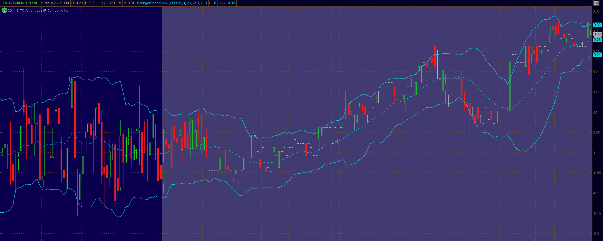

<!--yml

类别：未分类

date: 2024-05-18 16:39:01

-->

# VIX 和更多：瑞士信贷暂停 TVIX 的创建单位：这意味着什么

> 来源：[`vixandmore.blogspot.com/2012/02/credit-suisse-suspends-creation-units.html#0001-01-01`](http://vixandmore.blogspot.com/2012/02/credit-suisse-suspends-creation-units.html#0001-01-01)

在今天的正常交易时段结束后，瑞士信贷([CS](http://vixandmore.blogspot.com/search/label/CS))在一个简短的新闻稿中[宣布](http://finance.yahoo.com/news/Credit-Suisse-Temporarily-prnews-3084612990.html?x=0)，由于内部对 ETNs 规模的限制，“暂时暂停进一步发行 VelocityShares 每日 2 倍 VIX 短期 ETNs([TVIX](http://vixandmore.blogspot.com/search/label/TVIX))”。公司补充说，这一暂停“不会影响定价补充文件中描述的持有人的提前赎回权。其他由瑞士信贷发行的 ETNs 不受此暂停的影响。”

瑞士信贷的这一公告引起了众多问题，我将看看我能做些什么来回答其中一些更为紧迫的问题。

虽然这些都是猜测，但基于“ETNs 的内部规模限制”，似乎 TVIX 最近指数级的增长违反了与构成标普 500 VIX 短期期货指数 ER[超额回报]相关的[VIX 期货](http://vixandmore.blogspot.com/search/label/VIX%20futures)产品的头寸规模风险控制规则。当然我们不知道那些 VIX 期货产品的波动性在头寸规模问题中占了多少因素，但考虑到欧洲、中国和伊朗的潜在事件，我现在可以为任何 VIX 期货敞口采取非常保守的风险控制方法提出有力的论据。

创建单位的暂停意味着 40725 万股流通股代表了瑞士信贷的上限。虽然瑞士信贷将这一行动描述为临时性的，但没有特别的理由相信暂停只会持续几天。瑞士信贷同意发行新的 TVIX 创建单位可能需要几周甚至更长时间。例如，在 2009 年，美国天然气基金([UNG](http://vixandmore.blogspot.com/search/label/UNG))就其创建单位经历了监管审批问题，并暂停了七个星期的新的创建单位。在某一时刻，UNG 的交易价格高达净资产价值的 16%，但这种溢价最终被证明是一个短暂的波动。创建单位的暂停虽然不常见，但偶尔也会发生。就在两周前，例如，德意志银行([DB](http://vixandmore.blogspot.com/search/label/DB))在其七个商品 ETN 上[暂停了创建单位](http://www.indexuniverse.com/sections/news/10989-deutsche-suspends-creations-on-7-etns.html)。

投资者面临的最大问题是，TVIX 的创建单位暂停是否意味着 TVIX 会以其净资产值溢价或折价交易。考虑到供应受到限制而需求并未减少，最有可能的情况是 TVIX 至少与净资产值持平，或者可能出现溢价。估值将高度依赖于套利机会，如果 TVIX 开始与其净资产值分离，将会出现相当多的套利机会。VIX 期货提供了一个非常有吸引力的套利火力源，与 TVIX 非常相似的 2x VIX 期货 ETF [UVXY](http://vixandmore.blogspot.com/search/label/UVXY)，也称为 ProShares Ultra VIX Short-Term Futures ETF，也提供了套利机会。还可以通过 VXX、VIX 期权以及 SPX/SPY 等期权的套利机会。

就市场反应而言，我们有一些盘后市场数据可以让我们对 TVIX 公告的反应有一个初步的了解。TVIX 在常规交易时段收盘价为 17.01，当消息传来时，TVIX 最后交易价为 17.02，成交量激增。TVIX 最初上涨了超过 1%，达到 17.26，然后几乎回吐了所有涨幅，但又再次上涨至 17.31，然后在盘后交易时段收盘价为 17.28，较收盘价上涨了 0.27 或 1.6%。

交易员应该注意，每个 ETP 都有一个[日内指示价值](http://vixandmore.blogspot.com/search/label/intraday%20indicative%20value)（IV 或有时 IIV），这基本上是基于其基础证券最近价格的实时估计，是 ETP 的公平价值。这些报价每 15 秒更新一次，可以帮助确定证券与这一公平价值指标的偏差程度。在下面的图表中，我捕捉了 TVIX 与 TVIX.IV 在常规交易时段最后一小时以及在整个盘后交易时段（灰显）的差异，其中 TVIX 升至其日内指示价值之上 0.29。

在明天的交易中，请关注 TVIX 与其 IV 和 TVIX 与 UVXY 的比率。截至昨天的收盘，TVIX 的交易是 UVXY 的 2.625 倍。

在短期内，我预计 TVIX 的价格会逐渐出现小幅溢价，但套利会保持这种溢价的稳定。从更长期的角度来看，TVIX 的价格将继续对我在昨天概述的[TVIX 价格的四个关键驱动因素](http://vixandmore.blogspot.com/2012/02/four-key-drivers-of-price-of-tvix.html)做出反应，此外还会受到 TVIX 创建单位暂停造成的市场错位的影响。

如果 VIX 期货市场继续其近期增长轨迹，而 Credit Suisse 减少他们对这一增长市场的相对敞口，我预计在相对较近的将来会看到 TVIX 创建单位的恢复。这个发展时机很难预测，因为在这段时间内世界上会发生很多与波动性相关的事情。

相关文章：

来源：[thinkorswim/TD Ameritrade]

**披露(s):** *在撰写本文时做空 TVIX, VXX 和 UNG*
