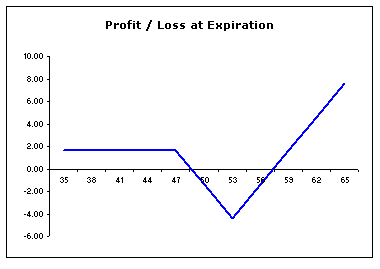

<!--yml

类别：未分类

日期：2024-05-18 18:45:49

-->

# VIX and More: 十字路口的期权

> 来源：[`vixandmore.blogspot.com/2008/01/crossroads-options_6596.html#0001-01-01`](http://vixandmore.blogspot.com/2008/01/crossroads-options_6596.html#0001-01-01)

如果你认为市场正处在十字路口，有可能向一个方向或另一个方向大幅移动，而不是从当前水平横向漂移，请举手。

我看到很多人举手，这并不让我惊讶，因为我同样认为市场正处在那种可能导致大幅波动的十字路口之前。当然，问题在于要正确预测方向。

玩一个预期的大幅波动但方向未定的最流行方式是使用[价差](http://www.optionsxpress.com/educate/strategies/straddle.aspx)或[勒颈](http://www.optionsxpress.com/educate/strategies/strangle.aspx)策略。如果你得到一个大动作——特别是如果你在建立头寸后不久就得到它——你很可能会锁定可观的利润。损失限于开仓成本，但如果预计波动性很大，开仓可能很昂贵，时间衰减可能很痛苦。

对于价值而言，我通常偏爱另一种方法：[回调价差](http://www.optionsxpress.com/educate/strategies/callbackspread.aspx)和[看跌回调价差](http://www.optionsxpress.com/educate/strategies/putbackspread.aspx)。在价差/勒颈策略和回调价差策略之间，有几个重要的区别。首先，价差和勒颈策略可能涉及相当大的初始支出。另一方面，通过出售一些平值或略微价外的看涨或看跌期权，基本上可以融资超出的资金看涨或看跌期权，最终实现净信用或零成本交易。其次，如果出售的期权是平值或价外的，如果标的资产没有变动，你将赚钱。最后，正如下面的（看涨回调价差）图表所示，回调价差的巨大收益是单向的。所以，与价差或勒颈不同，只有当你能正确预测市场动向时，才能获得大量利润。

如果你对回调价差感兴趣，可以查看 John Summa 在 Investopedia.com 上的[回调价差：突破交易者的好消息](http://www.investopedia.com/articles/optioninvestor/05/backspreads.asp)一文。
