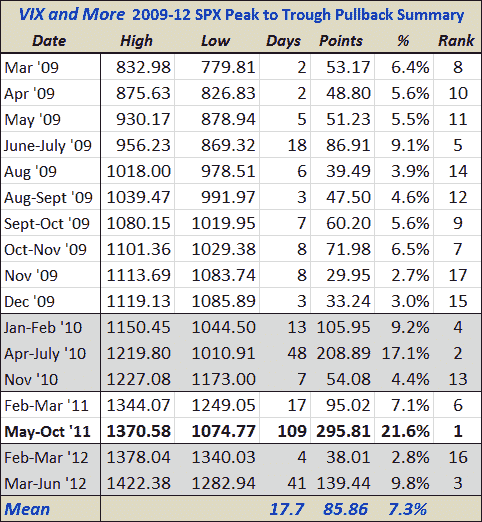

<!--yml

分类：未分类

日期：2024-05-18 16:29:02

-->

# VIX 和更多内容：自 2009 年 3 月以来的 9.8%回调是第三大的

> 来源：[`vixandmore.blogspot.com/2012/06/current-98-pullback-is-third-largest.html#0001-01-01`](http://vixandmore.blogspot.com/2012/06/current-98-pullback-is-third-largest.html#0001-01-01)

今天交易会话进行了两小时多一点之后，标普 500 指数似乎已经稳定下来。以今天早晨的低点 1282.94 来计算，SPX 从最高点到最低点的最大损失现在为 139.44 点——从 4 月 2 日的高点 1422.38 下跌了 9.8%。

下面的表格总结了自 2009 年 3 月初股票触底以来我所认为的所有重大回调。注意，目前的回调在幅度以及从最高点到最低点的持续时间上排名第三，截至目前为止，持续时间为 41 天。

对于那些可能对相同数据的图形概述感兴趣的人来说，[2009-2012 牛市回调的观察](http://vixandmore.blogspot.com/2012/05/look-at-pullbacks-of-2009-2012-bull.html)应该能更好地让当前的回调放入更广阔的视角。

那些想知道如果股票复制 2011 年的 21.6%跌幅或 2010 年的 17.1%回调，SPX 可能会跌得多低的人，相应的百分比跌幅将会把 SPX 分别带到 1115 和 1178。

相关文章：

*数据来源：[雅虎(Yahoo)]*

***免责声明(s):*** *无*
