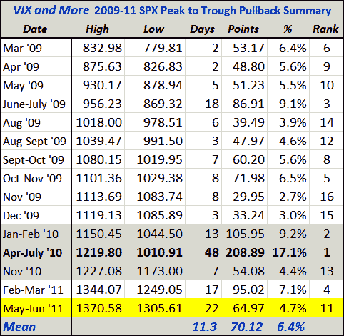

<!--yml

分类：未分类

日期：2024-05-18 16:50:08

-->

# 波动率指数与更多：自 2009 年 3 月牛市开始以来，当前标普 500 指数回调为第二长

> 来源：[`vixandmore.blogspot.com/2011/06/current-spx-pullback-second-longest.html#0001-01-01`](http://vixandmore.blogspot.com/2011/06/current-spx-pullback-second-longest.html#0001-01-01)

自从 2009 年 3 月这轮牛市开始以来，我周期性地发布标普 500 指数最重要的回调表格。随着今天标普 500 指数跌至 1305 点，从 SPX 在 1370 点的高点算起，现在已经有一个完整的月（22 个交易天）了。虽然 65 点的跌幅只相当于 4.7%的回调（15 次回调的平均跌幅为 6.5%；中位数为 5.6%），但这确实是从高点（5 月 2 日）到低谷（今天，假设 1305 点能守稳）时间上第二长的回调。

虽然长期下跌不一定是剧烈的，但若市场继续创新一个月的低点并且难以回升至 1370 点附近，那么这轮牛市转变为期横盘整理或是准备向下反转的可能性就越大。

目前看来，去年夏天那波 48 天的 17.1%的跌幅似乎不会受到威胁，但平均跌幅 6.5%将会把标普 500 指数带到 1281 点，中位数跌幅 5.6%将会把标普 500 指数带到 1294 点——一旦指数跌破 1300 点，各种新的情景将会开始出现。

我认为我们很快就会看到一些逢低买入的活动开始启动——可能就在今天下午——但随着我们等待非农就业数据的具体细节，股市似乎正处在某种转折点。

***披露：*** 无*
