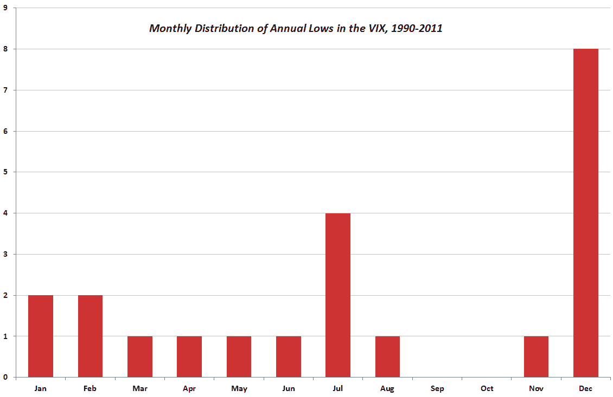

<!--yml

类别：未分类

日期：2024-05-18 16:46:08

-->

# VIX and More: December Is the Cruelest Month…For the VIX

> 来源：[`vixandmore.blogspot.com/2011/12/december-is-cruelest-monthfor-vix.html#0001-01-01`](http://vixandmore.blogspot.com/2011/12/december-is-cruelest-monthfor-vix.html#0001-01-01)

似乎没有哪个月的 VIX 会风平浪静。鉴于此，我似乎将负责至少一篇提醒投资者关于假期期间隐含波动率及 VIX 特性的文章。

有很多方法可以看待 VIX 在假期期间的典型下跌，我将其标记为（假期效应[holiday effect](http://vixandmore.blogspot.com/search/label/Holiday%20Effect)或[calendar reversion](http://vixandmore.blogspot.com/search/label/calendar%20reversion))以便于分类和追踪。从严格的 fundamental 角度来看，12 月/1 月假期期间最大的变化是交易天数减少，这意味着股票飞向一些不寻常目的地的跑道变短。另一个重要因素是[季节性](http://vixandmore.blogspot.com/search/label/seasonality)，特别是 12 月倾向于对股市产生提振作用。

我记录了这些因素如何影响 VIX 以及它们有时在图表上留下的奇怪印记，这些内容在去年的文章中有详细描述（见下述链接。）

今年我提供了一张图表，显示在任何给定年份，VIX 有大约 40%的机会在 12 月创下年度低点。正如我去年在[VIX 和圣诞节前一周](http://vixandmore.blogspot.com/2010/12/vix-and-second-half-of-december.html)提到的，低点通常出现在月底的最后一段时间，而且大多数情况下是在圣诞节前。

在三个交易日内，VIX 已经从上周四的 30.91 收盘价下跌了超过 20%。认为 VIX 会直线下降至今年 4 月 28 日创下的 2011 年低点 14.27 似乎有些牵强，但 stranger things have happened.

即使你认为[欧洲主权债务危机](http://vixandmore.blogspot.com/search/label/European%20sovereign%20debt%20crisis)在年底前还会爆发几次，也不要惊讶 VIX 在未来一周或两周内会“安息”。

相关文章：

**

披露：无**

数据来源：[CBOE, Yahoo]
