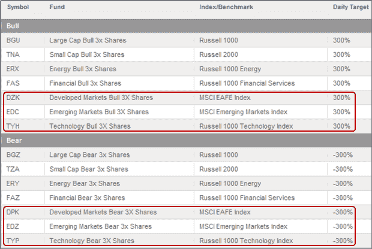

<!--yml

类别：未分类

日期：2024-05-18 18:07:37

-->

# VIX and More: Direxion Triple ETFs Add New Horses to Stable

> 来源：[`vixandmore.blogspot.com/2009/01/direxion-triple-etfs-add-new-horses-to.html#0001-01-01`](http://vixandmore.blogspot.com/2009/01/direxion-triple-etfs-add-new-horses-to.html#0001-01-01)

虽然关于三倍 ETFs 对长期投资者有用性的质疑声此起彼伏，但我一直认为，Direxion 的三倍 ETFs 将彻底改变日交易。

现在，随着三倍 ETFs 交易的新鲜感消退，交易员们有机会尝试各种交易三倍 ETFs 的方法，这些工具已经成为日交易场景的一个重要组成部分，尤其是在趋势日。

在利用这些带有核弹头的交易武器的吸引力方面，Direxion 上月增加了六个新的三倍 ETFs。尽管目前对新一批 ETFs 的兴趣有限，但我预测至少有一对三倍 ETF 有着光明的未来。我眼中的明星候选者是新兴市场 ETFs 的对：3 倍看涨（[EDC](http://vixandmore.blogspot.com/search/label/EDC)）和-3 倍看跌（[EDZ](http://vixandmore.blogspot.com/search/label/EDZ)）。原因很简单，就是竞争不足。目前，竞争来自于[EEV](http://vixandmore.blogspot.com/search/label/EEV)——ProShares 的-2 倍超短 MSCI 新兴市场 ETF。虽然 EEV 是一个热门的双倍反向 ETF，但它缺乏一个+2 倍的伴侣版本，这对于那些想要在不做空 EEV 的情况下对新兴市场进行杠杆看涨的人来说是个遗憾。

很难看到其他新的 ETF 对会吸引与新兴市场可能获得的相同关注。科技是一个受欢迎的投资主题，也是波动的重要来源，但当前的[ROM](http://vixandmore.blogspot.com/search/label/ROM)（2x）和[REW](http://vixandmore.blogspot.com/search/label/REW)（-2x）一直是以受欢迎程度为标准的二线 ETFs，远远落后于受欢迎的纳斯达克 100 ETFs[QLD](http://vixandmore.blogspot.com/search/label/QLD)和[QID](http://vixandmore.blogspot.com/search/label/QID)。Direxion 的新产品[TYH](http://vixandmore.blogspot.com/search/label/TYH)（3x）和[TYP](http://vixandmore.blogspot.com/search/label/TYP)（-3x）显然面临着艰巨的任务。

最后但同样重要的是，有一对基于摩根士丹利资本国际欧洲、澳大利亚和远东公司指数的交易所交易基金（ETFs）和流行的[EFA](http://vixandmore.blogspot.com/search/label/EFA) ETF。3 倍看涨基金（[DZK](http://vixandmore.blogspot.com/search/label/DZK)）和-3 倍看跌基金（[DPK](http://vixandmore.blogspot.com/search/label/DPK)）对我来说有很强的吸引力，作为投机或对冲非美国公司的手段，但这些基金是否会像 EFA 一样受到关注还有待观察。

记录在案，Direxion 在其当前的[招募说明书](http://direxionshares.com/pdfs/DRX_prospectus.pdf)中概述了将交易所交易基金增加到 32 只的计划。目前待审的 ETF 具有强烈的国际化（中国、印度、拉丁美洲、BRIC）和行业（清洁能源、房地产、住宅建筑商）特色。下图显示了当前可用的三倍 ETFs，最近增加的用红色圈出。

这些交易所交易基金（ETFs）并不适合胆小的人，任何考虑交易这些的人可能想阅读我关于这个话题的[初始帖子](http://vixandmore.blogspot.com/2008/11/prediction-direxion-triple-etfs-will.html)，以了解其中涉及的一些风险。

来源：[Direxion]
