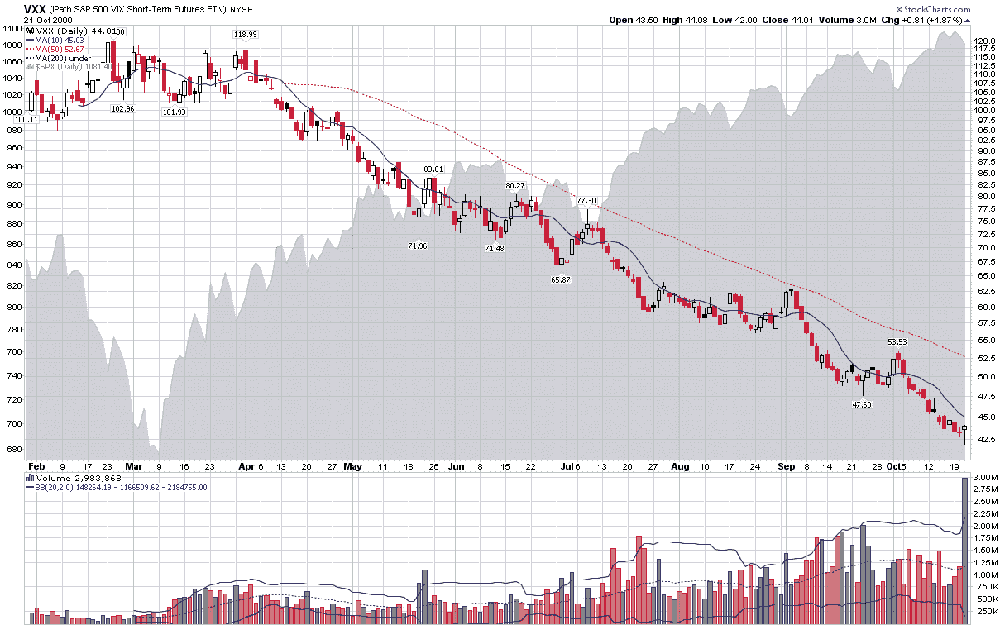

<!--yml

分类：未分类

日期：2024-05-18 17:25:33

-->

# VIX and More: Disappointment Lurks as Volume Surges in VXX

> 来源：[`vixandmore.blogspot.com/2009/10/disappointment-lurks-as-volume-surges.html#0001-01-01`](http://vixandmore.blogspot.com/2009/10/disappointment-lurks-as-volume-surges.html#0001-01-01)

月初时，当我写下[为什么 VXX 不是一个好的短期或长期交易](http://vixandmore.blogspot.com/2009/10/why-vxx-is-not-good-short-term-or-long.html)时，我以为那可能是我对这个话题的最后发言。好吧，我没有改变我的想法，但昨天当我看到 VXX 的交易量激增到新的记录，比老记录高 50%时，我摇头的次数比我想象的多。

或许这次新的 VXX 多头期待的是不同的事情，但昨天的数字只是强化了我早先的观点。的确，VXX 当天上涨了 1.87%，但 VIX 上涨了 6.32%。换句话说，VXX 多头参与的 VIX 的飙升不到 30%。

像昨天这样的走势阐述了我对为什么 VXX 不是一个好的短期波动性交易的一些思考。正如我过去所提到的：

**> “[VXX 动力因子](http://vixandmore.blogspot.com/search/label/VXX%20juice%20factor)（VXX 的变动作为 VIX 变动的百分比）显示了 VXX 相对于 VIX 的表现有多么令人失望。底线是，当你最需要它的时候，VXX 在跟踪 VIX 方面表现最差。”*

在利用波动率产品进行投机或对冲交易时，通常 VIX 期权（或期货）是最佳选择。对于短期波动性空头仓位，特别是当你看到 VIX 飙升时，考虑做空 VXX。那些偏好持有 VXX 多头仓位的人面临着不利的赔率。

关于 VXX 的不足，读者们可以查阅以下内容：

**来源：[StockCharts]**
