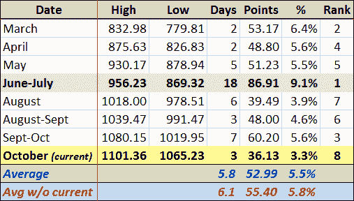

<!--yml

分类：未分类

日期：2024-05-18 17:24:57

-->

# VIX 和更多：回调有支撑吗？

> 来源：[`vixandmore.blogspot.com/2009/10/does-pullback-have-legs.html#0001-01-01`](http://vixandmore.blogspot.com/2009/10/does-pullback-have-legs.html#0001-01-01)

随着股票在交易最后半小时开始显示出一些稳定性，投资者心中最大的疑问是，当前的回调可能会延伸多远。

为了回答这个问题，我更新了在本月初提到的（意外受欢迎的）表格，详见[2009 年牛市中的回调](http://vixandmore.blogspot.com/2009/10/pullbacks-in-2009-bull-market.html)。修订后的表格显示，从 9 月 23 日回调至 10 月 2 日，标普 500 指数从高点到低点下跌了 5.6%，这是自 3 月份反弹以来，按百分比计算的第三大回调。

如果此次回调也达到 5.6%，那么标普 500 指数的下一个底部将在 1041 点。以前七个回调的平均 5.8%来计算，目标标普 500 指数底部将定为 1037 点。在这两种情况下，今天的低点代表到达目标底部的预期距离不到 60%。

因此，虽然我们可能今天不会触及短期底部，但一个合理的猜测是，如果标普 500 指数要符合近期历史常态，它还有大约 25 点的跌幅。

