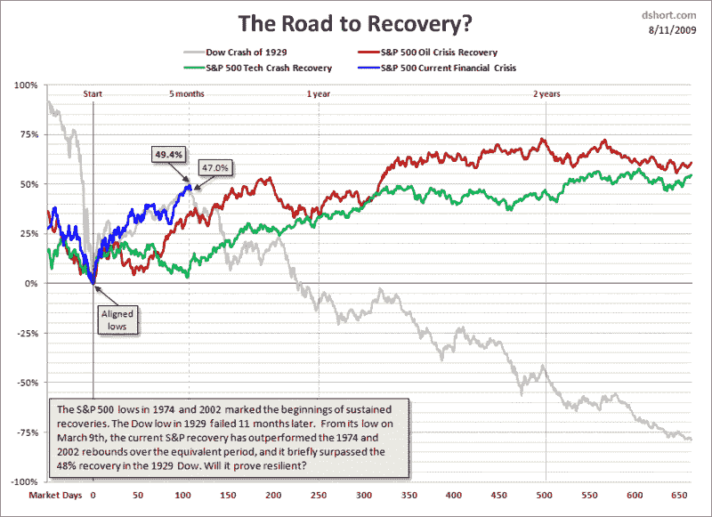

<!--yml

category: 未分类

date: 2024-05-18 17:34:12

-->

# VIX 与更多：Doug Short 和四只熊市的新视角

> 来源：[`vixandmore.blogspot.com/2009/08/doug-short-and-new-look-at-four-bad.html#0001-01-01`](http://vixandmore.blogspot.com/2009/08/doug-short-and-new-look-at-four-bad.html#0001-01-01)

在等待 FOMC 发表言论的同时，我想利用这段时间来强调一下 [Doug Short](http://www.dshort.com/) 的工作，可以在 [dshort.com](http://dshort.com/) 找到。

昨天，在[《复苏之路》](http://www.dshort.com/articles/2009/road-to-recovery.html)一文中，Doug 分析了四次强烈熊市的复苏情况。鉴于股票从 3 月份的低点回升的相对容易程度（见下图），Doug 采取了一种怀疑的态度（我也持有相同观点）对待股票前景：

> *“我们当前的市场比 3 月 9 日的低点高出 47%。它在相同时期内明显优于 1974 年和 2002 年的反弹，短暂超过了 1929 年道琼斯指数的 48% 涨幅。它会继续表现出韧性吗？”*

欲了解相关帖子和图形，以不同的视角查看上述内容，欢迎读者访问 Doug 的 [《真实》Mega-Bear Quartet 2000](http://dshort.com/articles/2009/mega-bear-2000.html)。

*[来源：dshort.com]*
