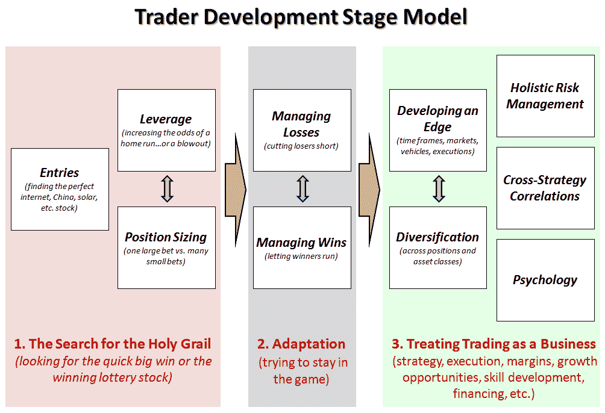

<!--yml

类别：未分类

日期：2024 年 05 月 18 日 17:28:13

-->

# VIX 与更多：草稿交易员发展阶段模型

> 来源：[`vixandmore.blogspot.com/2009/09/draft-trader-stage-development-model.html#0001-01-01`](http://vixandmore.blogspot.com/2009/09/draft-trader-stage-development-model.html#0001-01-01)

博客的被低估的乐趣之一是，你最终会与世界各地的各种人通信，这些人的道路很可能永远不会与我自己的道路交叉，如果不是因为博客。

部分原因是因为博客，我对其他交易员的思维方式有了更好的了解，他们遇到的问题以及他们如何克服障碍以取得成功，或者有时没有克服。

我有足够的证据表明，许多零售交易员在成长和发展为交易员时会经历某种典型的发展路径。为了开始对此进行对话，并为博客提供一个未来参考的框架，我想我会发布我脑海中正在形成的心智模型的草稿。

坦白说，我很惊讶我还没有看到类似的图表，如果有的话，我会很感兴趣听听。

请记住，我已尽力使模型保持简单。一旦基础问题得到讨论和改进，那么添加一些复杂性就容易多了。

所以...话不多说，我在下面附上了[交易员发展阶段模型](http://vixandmore.blogspot.com/search/label/trader%20development%20stage%20model)的初稿，希望相对容易理解。请注意，垂直灰色箭头应该表示相关问题之间的张力（杠杆与头寸大小、最小化失败者而最大化赢家、开发优势与多样化）。此外，虽然我认为所有问题都是迭代的，但我建议第三阶段的迭代过程是连续的。

一如既往，欢迎各种反馈意见。

