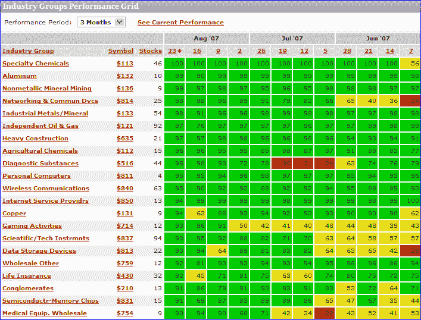

<!--yml

category: 未分类

date: 2024-05-18 19:01:35

-->

# VIX and More: Drilling Down on Sector Performance

> 来源：[`vixandmore.blogspot.com/2007/08/drilling-down-on-sectors.html#0001-01-01`](http://vixandmore.blogspot.com/2007/08/drilling-down-on-sectors.html#0001-01-01)

昨天我讨论了在九个[AMEX Select Sector SPDRs](http://www.sectorspdr.com/aboutspdrs/)背景下关于行业的议题。虽然这些是非常好的用于分析宏观行业表现的高级分类，但当你[深入这些 SPDRs](http://www.sectorspdr.com/sectortracker/)（点击任何一个查看详细信息）时，你会直接进入到个股级别，而没有子行业的分析优势。

幸运的是，还有许多其他优秀的免费资源可以帮助您深入分析行业表现。四个开始的好地方是：

我可能应该专门写一篇关于[Prophet.net](http://www.prophet.net/)的文章，这个网站对行业做了许多有趣的事情。我觉得特别有价值的工具包括对 214 个行业从 2 天到 5 年的[可排序的表现](http://www.prophet.net/explore/sectorrankings.jsp)以及从 3 个月到 5 年的[历史行业排名](http://www.prophet.net/explore/sectorPerformance.jsp)，这些都有助于图表格式（见下文）， complete with a drill down capability that pops up the charts for all the individual stocks in a particular sector. Also, from the I-just-couldn’t-help-myself category, while the pull down menu only allows for a minimum historical performance of 3 months, if you manually edit the URL, you can produce some interesting charts for shorter time frames.  For example, where the URL for the 3 month graphic ends in “…period=3m” it can be edited to “...period=**1**m” to generate a particularly interesting one month historical chart.  Try it!

MarketGauge.com 提供了一个行业组[总结](http://tal.marketgauge.com/PHS2/PHS.asp?t=1&k=11&v=3&s=104&sm=2&pg=1&z=10&c=fnd&e=prv_phstoday)，这是一个非常好的覆盖多个时间周期的图表工具，同时也为分析顶级和底部行业提供了四个基本分析选项。我最喜欢的一个功能是它突出了[推动最强/最弱组别上升的股票](http://tal.marketgauge.com/MGHome/PHSReportsIndex.asp)以及或许更有价值的[今日顶级组别中的领先股票](http://tal.marketgauge.com/PHS2/PHS.ASP?t=1&k=40&v=4&sm=1&s=104&pg=1&z=100&fq=1&a=5&spn=spTblBldTopStocksTopGroupsFast&spp=5,100,100000&x=Leading*Stocks*In*Todays*Top*Groups&c=fnd&e=fnd_ranks)页面，这其中包括基本数据和图表。

对于不同行业表现和动量的看法，你可能想尝试一下[ETFInvestmentOutlook.com](http://www.etfinvestmentoutlook.com/)。我经常使用他们两个功能：一个是[McClellan 广度 ETF 排名](http://www.etfinvestmentoutlook.com/rank_breadth_advance_decline_d.php)，另一个是[高低广度 ETF 排名](http://www.etfinvestmentoutlook.com/rank_breadth_new_highs_lows_avg_d.php)。

除了上述内容，还有许多有趣的与行业相关的热力图可供选择，包括两个特别值得注意的网站：

最后，如果你有一段时间没去过雅虎了，他们已经加强了自己的[行业中心](http://biz.yahoo.com/ic/index.html)页面。在那里开始冲浪的一个好地方是[领先者和落后者](http://biz.yahoo.com/ic/l/pip.html)部分。
