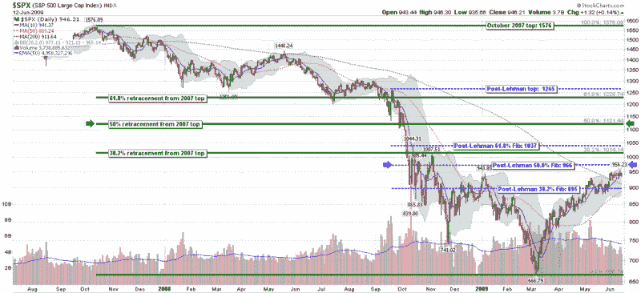

<!--yml

分类：未分类

日期：2024-05-18 17:43:04

-->

# VIX 和更多：SPX 的对立斐波那契

> 来源：[`vixandmore.blogspot.com/2009/06/dueling-fibonaccis-for-spx.html#0001-01-01`](http://vixandmore.blogspot.com/2009/06/dueling-fibonaccis-for-spx.html#0001-01-01)

我曾怀疑过，一些图表纯化主义者可能会对我将斐波那契回撤线范围限制在后雷曼世界提出反对意见，特别是因为 SPX 在雷曼兄弟破产申请之前已经修正了超过 300 点。

我的解释很简单，那就是 2008 年 9 月投资世界从基本面和技术面发生了巨大变化。我甚至用[市场 2.0](http://vixandmore.blogspot.com/2008/09/market-20.html)来形容当时的情况。技术上，当时市场从有序下跌过渡到了一系列的自由落体，将十日历史波动率推高至 10 月的最高 100 点。

在下面的图表中，我将两组不同的斐波那契回撤线叠加在了几乎两年的日线 SPX 数据之上。虚线的蓝色线条重复了我今天稍早时在[《SPX 与斐波那契阻力位 966》](http://vixandmore.blogspot.com/2009/06/spx-and-fibonacci-resistance-at-966.html)一文中呈现的后雷曼世界观；实线的绿色线条反映了一种更传统的斐波那契计算方法，以 2007 年 10 月的高点 1576 作为出发点。我为两组计算都突出了 50%的回撤水平，使用蓝色箭头表示后雷曼数据，绿色箭头表示回溯到 2007 年的数据。请注意，差异高达 155 点：后雷曼世界的 966 点和使用 2007 年高点的 1121 点。

如果市场继续反弹，我会鼓励读者关注绿色的斐波那契线。与此同时，我继续认为，在后 SPX 低于 1000 点的时期，至少在 SPX 保持在 1000 点以下时，关注后雷曼时期是恰当的。

*[来源：StockCharts]*
