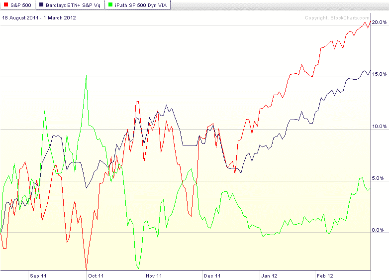

<!--yml

-   分类：未分类

-   日期：2024-05-18 16:37:29

-->

# -   VIX 和更多：动态 VIX ETP 作为长期对冲

> 来源：[`vixandmore.blogspot.com/2012/03/dynamic-vix-etps-at-long-term-hedges.html#0001-01-01`](http://vixandmore.blogspot.com/2012/03/dynamic-vix-etps-at-long-term-hedges.html#0001-01-01)

在目前[VIX 期货](http://vixandmore.blogspot.com/search/label/VIX%20futures)期限结构巨大的[正向市场](http://vixandmore.blogspot.com/search/label/contango)下，任何现在购买[VIX 期权](http://vixandmore.blogspot.com/search/label/VIX%20options)或[VIX 交易所交易产品](http://vixandmore.blogspot.com/search/label/VIX%20ETN)（ETP）的人，都必须为了有机会从增加的波动中获利而支付这种正向市场。基于正向市场的负面滚动收益率目前运行在 15%*每月*，这意味着在当前市场中，波动率[对冲](http://vixandmore.blogspot.com/search/label/hedging)对于多头股本持仓的成本极为昂贵。

幸运的是，投资者确实有一些具有不同吸引力的替代品。

目前有两大 VIX ETP 产品，[VQT](http://vixandmore.blogspot.com/search/label/VQT)和[XVZ](http://vixandmore.blogspot.com/search/label/XVZ)，它们试图通过使用一个动态调整长期波动率敞口的市场时机机制，来最小化负面滚动收益率的影响。在更加波动的市场中，敞口会增加；在较少波动的市场中，长期波动率敞口会非常低（在 VQT 的情况下）或者甚至翻转为较小的净空头持仓（在 XVZ 的情况下）。

VQT 更像是一种投资组合替代策略，而 XVZ 则更像是投资组合增强策略。具体来说，VQT 的 SPY 持仓长期在 60%至 97.5%之间，剩余部分（2.5% - 40%）分配给 VIX 短期期货的多头持仓（想想[VXX](http://vixandmore.blogspot.com/search/label/VXX)）。下面的链接会提供更多细节。

XVZ 另一方面，不持有任何长期股本组件，只持有短期（再次想想 VXX）和中期（想想[VXZ](http://vixandmore.blogspot.com/search/label/VXZ)）VIX 期货。这里的转折点是，尽管中期 VIX 期货成分可以在 50-100%之间，短期成分可以高达 50%，但低至*负数*30%。所以在某些情况下（例如，像我们目前所经历的非常陡峭的 VIX 期货期限结构），投资组合将相当于一个 30%的 VXX 空头持仓和 70%的 VXZ 多头持仓。总的来说，这种类型的投资组合应该非常接近于波动中性，在某些情况下甚至具有轻微的波动率空头倾向。

由于 XVZ 仅于 2011 年 8 月 18 日推出（VQT 可追溯至 2010 年 9 月），我选择了一张图表，展示了从 XVZ 推出至今，SPX（红线）、VQT（蓝线）和 XVZ（绿线）的相对表现。请注意，由于 VQT 的长期持仓，它更能把握低波动率慢牛市的机会。另一方面，在低波动率牛市中，XVZ 通常表现平淡，但如果 VIX 急剧上升，XVZ 可能会更好地利用这次波动率的跃升。

随着投资者思考疲惫的牛市和未来某个时刻不可避免的回调，VQT 和 XVZ 当然值得更深入的调查，还有一些旨在降低风险和对冲下行风险的非波动性 ETP，如[VSPY](http://vixandmore.blogspot.com/search/label/VSPY)、[SPLV](http://vixandmore.blogspot.com/search/label/SPLV)等。

相关文章：

****来源：**** StockCharts.com

****披露事项：**** 在撰写本文时，我持有长期看涨的 XVZ 和看跌的 VXX**
