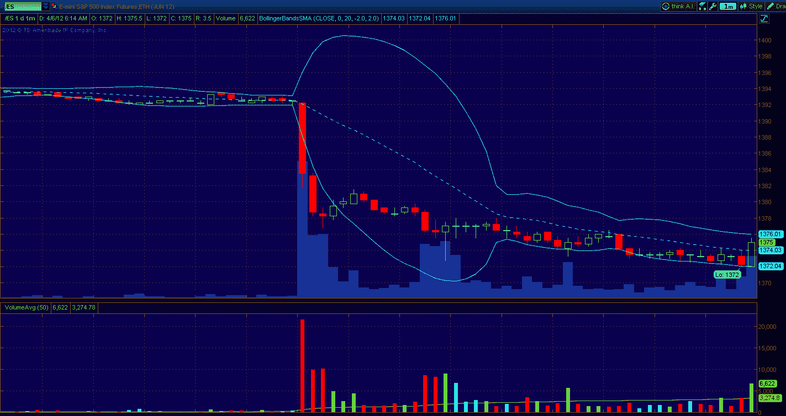

<!--yml

分类：未分类

日期：2024-05-18 16:33:27

-->

# 波动率更多信息：标普 500 股指期货因令人失望的非农就业报告下跌 1.4%

> 来源：[`vixandmore.blogspot.com/2012/04/e-mini-s-500-futures-fall-14-on.html#0001-01-01`](http://vixandmore.blogspot.com/2012/04/e-mini-s-500-futures-fall-14-on.html#0001-01-01)

以防您今天早上错过，在[非农就业报告](http://vixandmore.blogspot.com/search/label/nonfarm%20payrolls)显示 3 月份创造了 120,000 个就业岗位，[低于共识预期的 80,000](http://www.bls.gov/news.release/empsit.nr0.htm)之后，股指期货下跌了大约 1.4%，迷你标普 500 期货（[/ES](http://vixandmore.blogspot.com/search/label/%2FES)，如下图）跌至 1372 点——这是自 3 月 13 日以来未曾见过的水平。

在连续下跌三天之后，再次 1.4%的下跌将会使顶点到谷底的回调达到大约 3.5%，这代表了自 2009 年股市触底以来我们见证的 7.0%中位回调的一半。*[详见[将当前 2.6%的标普 500 回调置于近期历史背景中](http://vixandmore.blogspot.com/2012/03/putting-current-26-spx-pullback-in.html)获取更多详情。]*

自 10 月初以来标普 500 指数上涨 32%的投资者无疑会迅速保护利润，在一个普遍认为股市迟迟需要回调的环境中。直到最近，我们一直缺少那种促使卖出的催化剂。周二 FOMC 会议纪要中，美联储似乎不太倾向于走向 QE3 或其他刺激措施的方向，似乎促使了卖家入市。今天的非农就业数据又提供了另一个催化剂，但它可能没有一些人预期的那么强大。初请失业金人数[持续下降](http://www.dol.gov/opa/media/press/eta/ui/eta20120617.htm)，表明就业市场平稳或正在改善，这提高了 3 月份的非农就业数据是一个统计异常值，或者说在今天的数据未来修订中会显得更加强劲的可能性。

然而，最重要的是，就业的疲软正是美联储重新考虑进一步刺激措施可能性的问题，包括 QE3。至少，今天的非农就业报告削弱了关于 3 月 13 日（又是这个日期）会议的周二 FOMC 会议纪要中显示的日益增长的鹰派立场。无论是当前的深度价外还是价内，伯南克看涨期权（[Bernanke put](http://vixandmore.blogspot.com/search/label/Bernanke%20put)）的潜在存在不应被忽视。

相关文章：

*[来源：thinkorswim/TD Ameritrade]*

***披露(s):*** *无*
