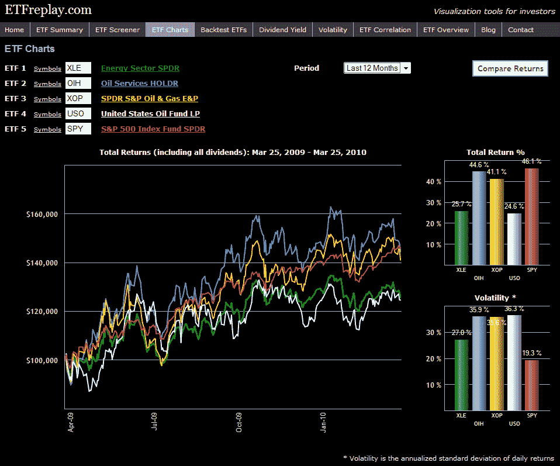

<!--yml

分类：未分类

日期：2024-05-18 17:12:56

-->

# VIX and More: ETFreplay.com Brings ETFs, Volatility and Charts Together Under One Roof

> 来源：[`vixandmore.blogspot.com/2010/03/etfreplaycom-brings-etfs-volatility-and.html#0001-01-01`](http://vixandmore.blogspot.com/2010/03/etfreplaycom-brings-etfs-volatility-and.html#0001-01-01)

作为一个全职投资者和兼职博主，我对那些专注于 ETF、波动性和图表的网站有着特别的喜好——这三个主题是我在这个空间里重点介绍的。因此，当[ETFreplay.com](http://etfreplay.com/)在今年早些时候出现，专门提供 ETF 信息，展示一些独特且有吸引力的图表，并表现出对波动性的兴趣时，我感到很兴奋。

网站仍在发展中，但已经是一个有趣且信息丰富的目的地，特别是对于那些对 ETF 感兴趣的投资者。目前提供的功能包括筛选、回测、相关性、图表化等。还有一个[博客](http://etfreplay.com/blog/)，提供与 ETF 相关的许多问题的图表和评论。内容非常优秀，但正是这些图表激发了我们网站的口号：“投资者的可视化工具”。我下面附上了一个示例图表，在这个图表中，我决定比较过去一年里四种流行能源 ETF（[XLE](http://vixandmore.blogspot.com/search/label/XLE)、[OIH](http://vixandmore.blogspot.com/search/label/OIH)、[XOP](http://vixandmore.blogspot.com/search/label/XOP)和[USO](http://vixandmore.blogspot.com/search/label/USO)）与标普 500ETF（SPY）的表现和波动性。图表自己会说话。

在我看来，只有少数几家顶级 ETF 网站。虽然可能现在还为时尚早，不能将 ETFreplay.com 列入其中，但根据网站改进的速度，我怀疑这个差距不会持续太久。

关于相关主题的更多信息，读者可以查看：

*[来源：ETFreplay.com]*

***披露(s):*** *在撰写本文时持有 XOP*
