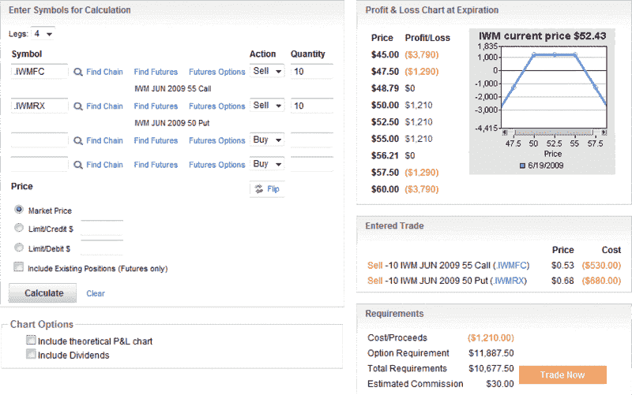
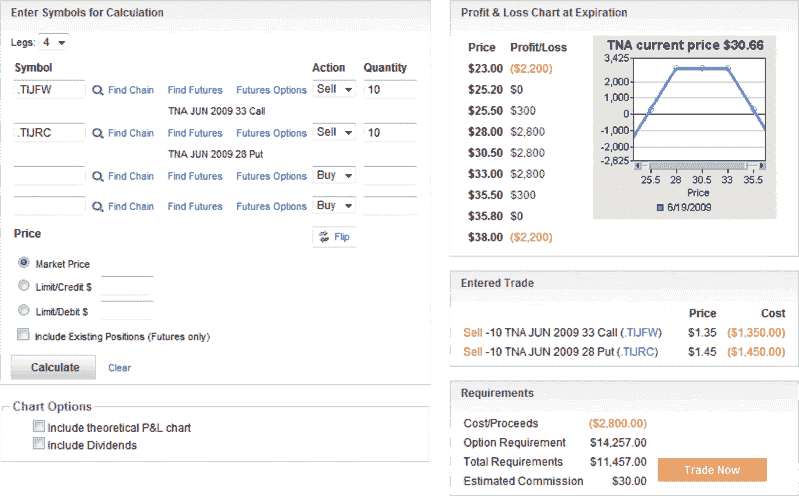

<!--yml

分类：未分类

日期：2024-05-18 17:44:35

-->

# VIX and More: ETFs, Leverage and Strangles

> 来源：[`vixandmore.blogspot.com/2009/06/etfs-leverage-and-strangles.html#0001-01-01`](http://vixandmore.blogspot.com/2009/06/etfs-leverage-and-strangles.html#0001-01-01)

我对上周收到的反馈意见的量感到惊讶。[使用期权控制杠杆 ETF 的风险](http://vixandmore.blogspot.com/2009/05/using-options-to-control-risks-in.html)的反馈明显显示出市场对于期权和杠杆 ETF 有很大的兴趣。

我收到的电子邮件中有一些关于与 ETF 相关的策略的问题。记录在案的是，我这里的意图并不是提倡某个特定的策略，而仅仅是阐明我认为应该成为任何期权交易者交易工具的一部分的各种战略构建模块。

说完这些，让我花一分钟谈谈[看跌期权策略](http://vixandmore.blogspot.com/search/label/strangle)。我意识到我这里并没有像[期权价差策略](http://vixandmore.blogspot.com/search/label/straddle)那样经常谈论看跌期权策略，但实际上，当我出售期权时，我更倾向于交易看跌期权策略而不是期权价差策略。尽管如此，看跌期权策略的最大盈利点往往与[西西弗斯](http://en.wikipedia.org/wiki/Sisyphus)式的彩票相似，而看跌期权策略的最大盈利区间要宽得多，也更容易管理。

在下面的图表中，我截取了[IWM](http://vixandmore.blogspot.com/search/label/IWM)的短期看跌期权策略快照，IWM 是一种追踪罗素 2000 小盘股指数的 ETF。这个看跌期权策略是通过卖出 10 份 6 月份 50 美元的看跌期权和 10 份 6 月份 55 美元的看涨期权来构建的。在这个例子中，看跌期权的[隐含波动率](http://vixandmore.blogspot.com/search/label/implied%20volatility)为 37，看涨期权的隐含波动率为 31。请注意，这个看跌期权策略的最大收益为 1210 美元，如果 IWM 在到期时收盘价介于 50 至 55 美元之间，则可以实现这一收益。完整的盈利区间从 48.79 美元到 56.71 美元，跨度为 7.92 点。

[TNA](http://vixandmore.blogspot.com/search/label/TNA)是同一只小盘 Russell 2000 指数的 3 倍 ETF。尽管 IWM 收盘价为 52.43，TNA 收盘价为 30.66，比其 1 倍兄弟高出不到 41%。然而，即使价格低得多，3 倍 ETF 的威力在查看期权时立即显露出来。下图展示了通过卖出 10 份 6 月 28 日的看跌期权和卖出 10 份 6 月 33 日的看涨期权所创造的结果。与 IWM 示例类似，这些执行价格之间有五个点的间隔。下面盈利和亏损图形中的差异主要是由于波动率的极端差异。在这个例子中，看跌期权的隐含波动率为 92，看涨期权的隐含波动率为 87——几乎，但并不完全是我 WM 的三倍。由于波动率较高，最大利润为 2800 美元（在 28 和 33 之间），而整个盈利区间为 10.60 点，从 25.20 到 35.80。

总之，对于大约 2.6 倍的隐含波动率，TNA 提供了 2.3 倍更大的最大利润和 1.3 倍更大的盈利区间。

这些比较承认起来并不完美，因为 IWM 和 TNA 的交易价格差异很大，但它们确实传达了这样一个观点：在一个震荡市场中，一个卖空 3 倍杠杆 ETF 期权的期权卖方可以迅速累积大量收益（或损失）。当然，通过“购买翅膀”并把勒套变成铁[condor](http://vixandmore.blogspot.com/search/label/condor)可以使同样的交易风险大大降低。

想了解相关文章，请查看[期权机会矩阵](http://vixandmore.blogspot.com/2009/04/options-opportunity-matrix.html)。

*[图表：optionsXpress]*
