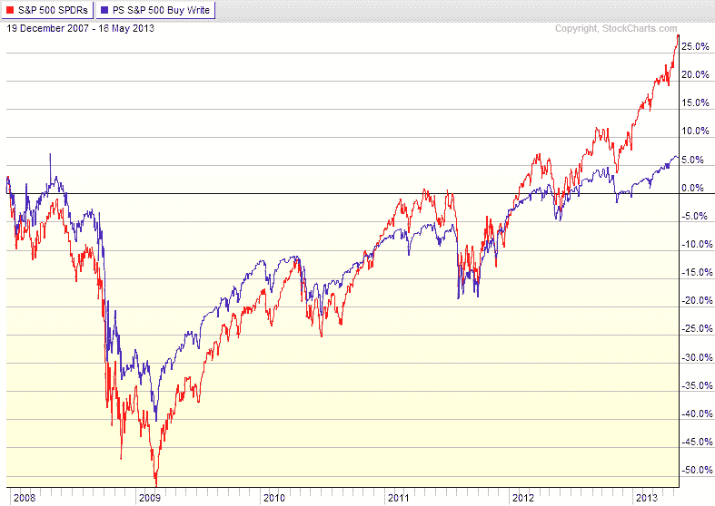

<!--yml

分类：未分类

日期：2024-05-18 16:16:38

-->

# VIX and More: ETPs Turn to Selling Options to Generate Income

> 来源：[`vixandmore.blogspot.com/2013/05/etps-turn-to-selling-options-to.html#0001-01-01`](http://vixandmore.blogspot.com/2013/05/etps-turn-to-selling-options-to.html#0001-01-01)

在我撰写[期权和波动率 ETP 全景](http://vixandmore.blogspot.com/2013/02/the-options-and-volatility-etps.html)不久后， Credit Suisse([CS](http://vixandmore.blogspot.com/search/label/CS))增加了另一个买入写期权/覆盖看跌期权 ETP 到产品线中：瑞士信贷白银共享覆盖看跌期权 ETN([SLVO](http://vixandmore.blogspot.com/search/label/slvo))。

通过 SLVO，瑞士信贷基本上是在将其与 Credit Suisse Gold Shares Covered Call ETN([GLDI](http://vixandmore.blogspot.com/search/label/GLDI))开创的方法学进行扩展。在 GLDI 和 SLVO 的情况下，ETP 针对黄金([GLD](http://vixandmore.blogspot.com/search/label/GLD))和白银([SLV](http://vixandmore.blogspot.com/search/label/SLV))的底层[商品](http://vixandmore.blogspot.com/search/label/commodities)ETF 出售覆盖看跌期权，以产生一些收入，在这个过程中，选择放弃一些上行潜力。在这两种情况下，ETP 从到期前 39 天开始出售覆盖看跌期权，并在到期前 35 天完成销售。一个月后，ETP 在到期前五到九天期间回购这些覆盖看跌期权。这些覆盖看跌期权的交易净收益随后作为月度股息支付。这个股息支付没有保证，并且可能每月大幅波动。自上市以来前四个月，GLDI 的月度股息为 0.1146、0.0724、0.1319 和 0.0572。

由于白银通常比黄金波动性大得多，SLVO 选择出售 6%虚值的看跌期权，而 GLDI 仅出售 3%虚值的看跌期权。除了虚值选择或资金状况方面的差异外，GLDI 和 SLVO 采用的策略基本上是一样的。

当然，当标的资产价格稳定或缓慢上涨时，覆盖看跌期权策略效果最佳。在最近 GLD 和 SLV 的急剧下跌中，覆盖看跌期权确实提供了一定程度的下行保护，但考虑到 GLD 在上个月仅两个交易日内下跌了 13%，覆盖看跌期权提供的下行保护几乎比四舍五入的误差大不了多少。除了当标的资产经历强烈的牛市行情时，覆盖看跌期权和买入写期权策略通常在所有情况下都能超越标的资产的长期持仓表现。（见下图了解详情。）

更广泛地思考，GLDI 和 SLVO 的引入应该会强化这样一个观点，即随着 ETP 现在横跨各种资产类别和替代投资，覆盖式看涨期权策略可以以许多非传统方式实施。最受欢迎的传统方法是 PowerShares 标普 500 买写期权([PBP](http://vixandmore.blogspot.com/search/label/PBP))，它针对流行的股票指数出售覆盖式看涨期权。然而，没有理由不能有类似的产品针对更波动的群体或板块，如新兴市场([EEM](http://vixandmore.blogspot.com/search/label/EEM))、小盘股([IWM](http://vixandmore.blogspot.com/search/label/IWM))或半导体([SMH](http://vixandmore.blogspot.com/search/label/SMH))等，仅举几例。甚至可以将替代资产纳入覆盖式看涨期权的范畴。我说的不仅仅是像[原油](http://vixandmore.blogspot.com/search/label/crude%20oil)、[铜](http://vixandmore.blogspot.com/search/label/copper)或[玉米](http://vixandmore.blogspot.com/search/label/corn)这样的东西，为什么不可以有覆盖式看涨期权针对房地产、货币，甚至波动率 ETP 呢？

更好的是，为什么仅限于覆盖式看涨期权呢？我在这里讨论过多次的一个策略就是出售现金担保的看跌期权。美国股票高波动率看跌期权写入指数 ETF（[HVPW](http://vixandmore.blogspot.com/search/label/HVPW)）的最近推出将[看跌期权写入](http://vixandmore.blogspot.com/search/label/put-write)策略带入了 ETP 市场。遗憾的是，到目前为止，看跌期权写入策略还没有找到更广泛的受众，否则它们也可以超越标普 500 指数舒适的范围。

假设这个市场最终不会再天天上涨，投资者们将不得不寻找其他增长投资组合的方法，无疑，对收益的争夺将会加剧。随着 ETP 现在开始出售期权来产生收入，投资者们可能想看看上面提到的那些封装产品，或者考虑他们可能希望如何在自己的投资上实施类似的策略。

*[来源(s)：StockCharts.com]*

相关文章：

***披露(s)：*** *在撰写本文时持有 GLDI 和 HVPW*
