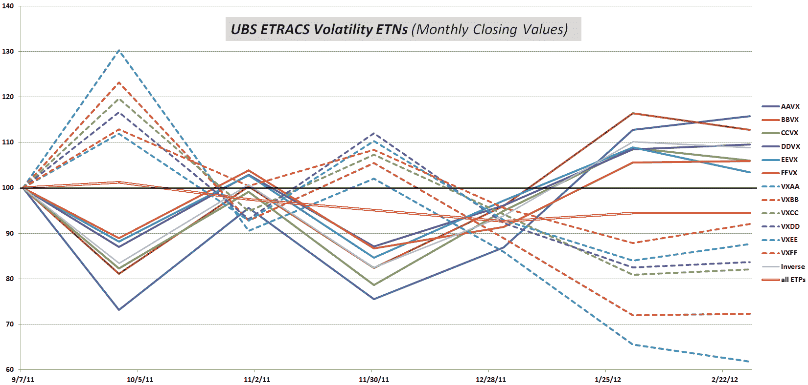

<!--yml

分类：未分类

日期：2024-05-18 16:37:54

-->

# VIX and More: ETRACS Volatility ETPs

> 来源：[`vixandmore.blogspot.com/2012/02/etracs-volatility-etps.html#0001-01-01`](http://vixandmore.blogspot.com/2012/02/etracs-volatility-etps.html#0001-01-01)

虽然在过去几周内[TVIX](http://vixandmore.blogspot.com/search/label/TVIX)和[UVXY](http://vixandmore.blogspot.com/search/label/UVXY)等产品成为了一夜之间的明星，但一组继续在相对默默无闻中努力的是[UBS](http://vixandmore.blogspot.com/search/label/UBS)在 2011 年 9 月推出的十二种 ETRACS VIX ETN 产品。

ETRACS 产品的构思很简单：它们基于[VIX 期货](http://vixandmore.blogspot.com/search/label/VIX%20futures)，包括长期和反向产品，目标加权平均到期时间为 1 个月、2 个月、3 个月、4 个月、5 个月和 6 个月。产品代码也很直接：[VXAA](http://vixandmore.blogspot.com/search/label/VXAA)代表 1 个月长期产品，[AAVX](http://vixandmore.blogspot.com/search/label/AAVX)代表 1 个月反向产品；[VXBB](http://vixandmore.blogspot.com/search/label/VXBB)代表 2 个月长期产品，[BBVX](http://vixandmore.blogspot.com/search/label/BBVX)代表 2 个月反向产品；等等。

本质上，ETRACS 波动率产品有望让标准经纪账户的投资者能够做多或做空 VIX 期货曲线的几乎任何部分，而无需在期货账户中交易，也无需处理维持期货账户所带来的额外监管、保证金和其他复杂性。

实际上，ETRACS 产品的受众群体有限。今天所有十二种产品的总成交量不到 10,000 股，不幸的是，这通常是 ETRACS 产品套装的一个典型交易日。

即使你选择不交易任何 ETRACS 波动率 ETP，研究它们的价格波动也能获得相当多的洞察力。所有产品都是第一次在 9 月 8 日交易，当时 VIX 的交易价格约为 34。在此 intervening period，所有长期 VIX 产品都失去了地盘（从-8%到-38%，取决于目标到期时间），而所有反向产品都赚钱（从+5.9%到+15.8%，取决于目标到期时间），如下面的图表所示。很大程度上由于期限结构和负滚动收益的破坏，损失超过了收益，自这些产品推出以来的五个月零二十天，所有十二种 ETP 的平均表现（实心亮红色线）亏损了 5.6%。

如果这些 ETRACS 产品最终能够长寿（而且如果真的如此，它们可能需要更多的粉丝），那么它们将描绘出 VIX 期限结构演变的迷人画面以及负收益和正收益滚动收益率的后果。现在，即使是寿命短暂的镜像线条也讲述了一个值得关注的故事。

相关文章：

**来源：** *雅虎*

**披露事项：** *在撰写本文时，长期持有 BBVX；做空 TVIX 和 UVXY*
