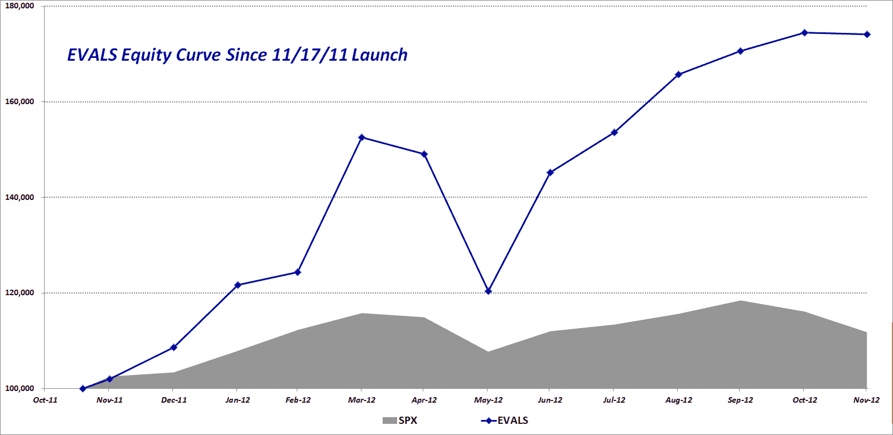
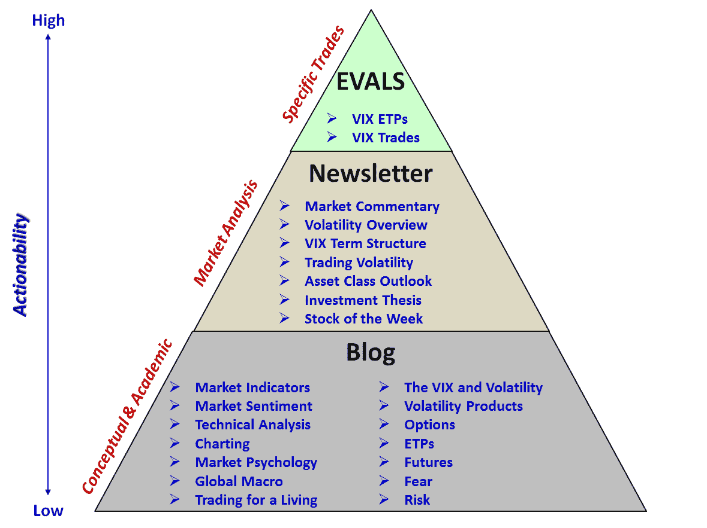

<!--yml

分类：未分类

日期：2024-05-18 16:22:03

-->

# VIX 和更多：EVALS 详述第一年的表现数据

> 来源：[`vixandmore.blogspot.com/2012/12/evals-details-performance-data-for.html#0001-01-01`](http://vixandmore.blogspot.com/2012/12/evals-details-performance-data-for.html#0001-01-01)

在大多数情况下，我尽量在这个空间里不透露关于[VIX 和更多订阅者时事通讯](http://vixandmoresubscriber.blogspot.com/)和[EVALS](http://vixandmoreevals.blogspot.com/)的信息，但最近 EVALS 已经成为一种现象，因此我决定在这里讨论它会更简单，而不是继续回答涌入我收件箱的大量关于这项服务的问题。

本着传统，我将在这里简要提及几个亮点，并建议对更多信息感兴趣的读者访问[EVALS 博客](http://vixandmoreevals.blogspot.com/)，从今天的帖子开始阅读：[EVALS 一周年总结和表现更新 (+74.13%)](http://vixandmoreevals.blogspot.com/2012/12/evals-one-year-summary-and-performance.html)。

自 2011 年 11 月 17 日以来，EVALS 完全专注于 VIX 及基于波动性的 ETP。在运营的第一年，EVALS 模型投资组合共交易了 12 种不同的 VIX 和波动性 ETP，总计达 81 次。大约 63.6%的已关闭交易是盈利的，平均而言，盈利的交易收益是平均亏损交易损失的 5.4 倍，持有期中位数为 60 天。

对于那些对风险调整后的绩效指标感兴趣的人士，EVALS 在第一年的夏普比率达到了 1.65，索提诺比率达到了 2.39，施瓦格收益与亏损比率达到了 2.91。更多信息和表现数据可以在[EVALS 博客](http://vixandmoreevals.blogspot.com/)上找到。可能还有以下股票曲线也会引起兴趣，该曲线显示了一个假设的模型投资组合的表现，该组合在 2011 年 11 月 17 日的启动日期投资了 EVALS 和标普 500，初始资金为 10 万美元。

最后，对于可能对 EVALS 中包含的内容、时事通讯以及博客中发布的内容感到困惑的任何人士，我更新了我所说的内容金字塔，希望它能（大部分情况下）自我解释清楚。

相关文章（来自[EVALS 博客](http://vixandmoreevals.blogspot.com/)）：

**披露声明：** 无
