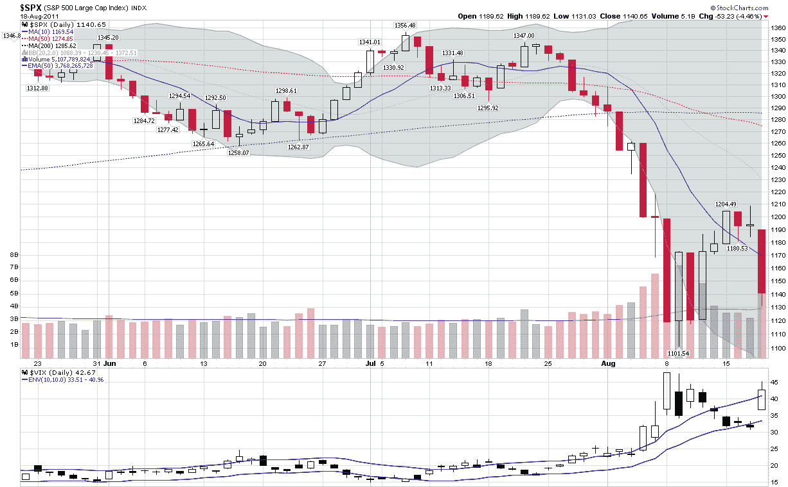

<!--yml

类别：未分类

日期：2024-05-18 16:48:46

-->

# 波动率指数(VIX)和更多：回声波动率与另一个 VIX 双顶

> 来源：[`vixandmore.blogspot.com/2011/08/echo-volatility-and-another-vix-double.html#0001-01-01`](http://vixandmore.blogspot.com/2011/08/echo-volatility-and-another-vix-double.html#0001-01-01)

回到 2007 年，我广泛地撰写了一种现象，我称之为[回声波动率](http://vixandmore.blogspot.com/search/label/echo%20volatility)，在这种现象中，大的 VIX 暴跌经常伴随着初始暴跌后大约一个月左右的一个同样规模的二次暴跌。在 2008 年两次 VIX 超过 80 的双顶之后，我在一篇题为[VIX 双顶的重要性](http://vixandmore.blogspot.com/2008/12/double-tops-in-vix.html)的文章中重述了这个主题。

果不其然，我们又迎来了一场波动率的暴风雨，我们看到 8 月 8 日出现了看似是 48.00 的 VIX 顶点，紧接着今天暴跌至 45.28——VIX 暴跌之间只有九天。

在 VIX 双顶的先例中，最引人注目的无疑是 2008 年的那次，当时 VIX 创下了 89.53 的历史新高，回调超过 45 点，然后在 20 个交易日后暴力反弹至 81.48。VIX 暴跌的时机让人不寒而栗地想起了 1998 年[长期资本管理公司](http://vixandmore.blogspot.com/search/label/Long%20Term%20Capital%20Management)的灾难，当时 VIX 在 9 月 11 日达到 48.06，然后恰好 20 天后危机高潮达到 49.53。

除了这些 20 天周期之间的 VIX 暴跌，还有一个 9 天的双顶先例可以追溯到 2002 年，与[世界通信](http://vixandmore.blogspot.com/search/label/WorldCom)的破产申报文件相符。在那里我们看到 7 月 24 日达到 48.46 的高点，九天后再次暴跌至 45.21。

总之，在记录到的最高的七个 VIX 暴跌中，其中四个出现了两次独立的暴跌，在这两次暴跌中 VIX 都超过了 45，这些暴跌从 9 天到 20 天不等。

显然，在当前这场波动率的暴风雨过去之前，还有根本性的因素可能会触发 VIX 超过 45 点的另一波暴跌，但如果历史可以作为指引，那么数字“二”可能将是幸运数字。

相关文章：

**[图片: StockCharts.com]**

****披露：**** *写作时做空 VIX*
