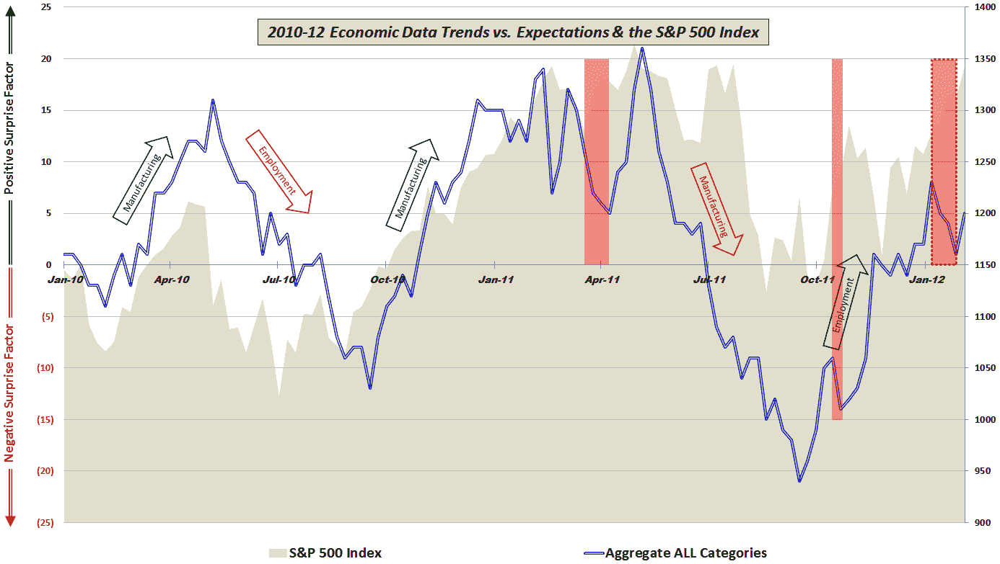

<!--yml

分类：未分类

日期：2024-05-18 16:41:17

-->

# VIX 和更多：经济数据：股市的分歧还是确认？

> 来源：[`vixandmore.blogspot.com/2012/02/economic-data-divergence-or.html#0001-01-01`](http://vixandmore.blogspot.com/2012/02/economic-data-divergence-or.html#0001-01-01)

上一次我关注美国经济数据相对于预期的表现，大约是两个月前，我注意到：

> **“一个人当然可以认为数据在 4 月至 9 月期间表现不如股票，但在过去的 2 个半月里，数据的表现已经超过了股票。”**
> 
> **虽然传统观点认为股市领先经济基本面 6-9 个月，但这个图表并不支持这一观点。相反，很有趣的是，现在至少一些欧洲焦虑似乎已经成为了过去，看看这两个哪个会 assumed a leading role**

有了事后诸葛亮的优势，很明显股票一直占据主导地位，而且在某种程度上，股票价格的上涨对经济数据产生了积极影响。1 月份的大部分时间里，股票与经济数据之间存在显著分歧（见下图虚线红色框），股票明显上涨，而经济数据却经常低于市场共识预期。

上周的[非农就业](http://vixandmore.blogspot.com/search/label/nonfarm%20payrolls)数据和[ISM](http://vixandmore.blogspot.com/search/label/ISM)服务业指数可能标志着经济数据表现相对于预期的转折点，但也很清楚，数据趋势仍然明显落后于股价趋势。

对于这次更新，我用箭头在图表上做了注释，显示制造业和[就业](http://vixandmore.blogspot.com/search/label/employment)是股市上涨的经济基础。这次就业数据似乎正在朝着正确的方向发展，但制造业却难以达到预期——至少在过去两个月里。

**[对于那些对构成此图表的详细数据和所使用的方法感兴趣的读者，建议查看下面的链接。对于那些希望了解更多关于构成我汇总数据计算的具体经济数据发布的读者，请查看* [*经济数据年度图表(2010)*](http://vixandmore.blogspot.com/2011/01/chart-of-week-year-in-economic-data.html)*。]*

相关文章：

**[来源：各种]**

****披露：**** 无
