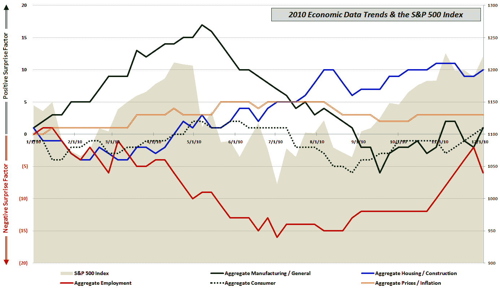

<!--yml

category: 未分类

date: 2024-05-18 16:57:13

-->

# VIX and More: 经济数据冻结至下周四

> 来源：[`vixandmore.blogspot.com/2010/12/economic-data-frozen-until-next.html#0001-01-01`](http://vixandmore.blogspot.com/2010/12/economic-data-frozen-until-next.html#0001-01-01)

今天的数据发布包括了[非农就业](http://vixandmore.blogspot.com/search/label/nonfarm%20payrolls)、ISM 非制造业调查和工厂订单，这是经济数据繁忙的一周，由于下一次数据发布还有一个不寻常的长时间间隔（下周四的失业救济申请），这似乎是更新我的经济数据与预期相对比的持续图表的好时机。

上次我在十月底更新这张图表时，我注意到，“自九月初以来，正面报道明显增加——巧合的是，这与股市的上升趋势相吻合。” 尽管今天的非农就业报告除外，但正面惊喜的模式在十月份和十二月初的第一周重复出现。尽管就业继续是最大的故事，但消费者近期的好转和制造业的复苏在一定程度上抵消了劳动力市场方面的坏消息，并暗示就业市场可能很快显示出改善的迹象。

这张图表中的另一个大新闻是，尽管房地产市场和建筑市场看起来很糟糕，但数据一直高于降低的市场预期。

最后，美国经济数据在如此长的时间内缺失是很少见的。在许多方面，新数据点的缺失意味着目前实施的投资趋势在下周内将几乎没有证据来质疑其有效性。这也意味着在 12 月 14 日星期二召开的美联储公开市场委员会(FOMC)会议上，美联储面前将几乎没有其他新的信息。

相关文章：

***披露信息：*** *无*
