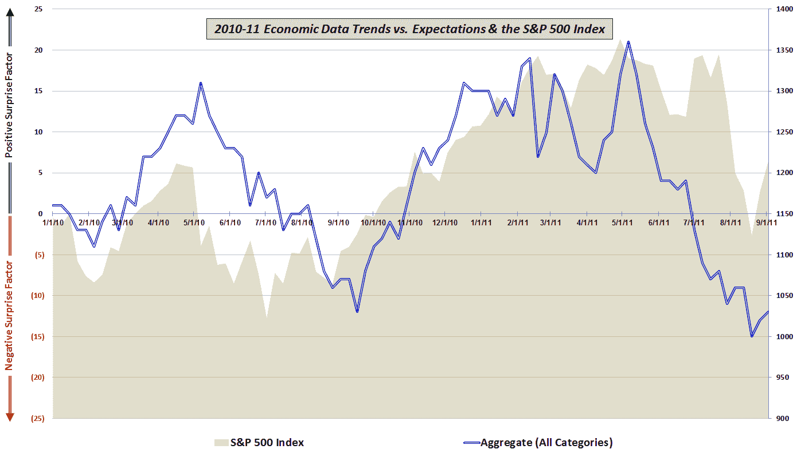

<!--yml

分类: 未分类

日期: 2024-05-18 16:48:36

-->

# VIX 和更多：经济数据不支持悲观和末日预言——至少现在是这样

> 来源：[`vixandmore.blogspot.com/2011/08/economic-data-not-supporting-gloom-and.html#0001-01-01`](http://vixandmore.blogspot.com/2011/08/economic-data-not-supporting-gloom-and.html#0001-01-01)

过去一年多，我一直研究美国经济数据相对于预期的表现，并发布了显示五个组(制造业/综合、房地产/建筑、就业、消费者和价格/通胀)趋势的图表，以更好地了解哪些经济领域的表现超过预期，哪些落后。 *[详细的图表请查看链接 2-8 below.]*

上次([经济数据 vs. 预期和股价](http://vixandmore.blogspot.com/2011/06/economic-data-vs-expectations-and-stock.html), 2011 年 6 月 2 日)我选择了一张图表，它综合了所有五个类别的数据，以强调主要观点，即经济报告一直未达到预期，有时相差甚远，尽管股价似乎大部分在原地踏步。股市又坚持了几周，但最终它们开始表现得像数据——好像它们的脚踝上绑了一个锚。

今天的消费者信心数据](http://www.conference-board.org/data/consumerconfidence.cfm)又一次大幅未达预期，但过去两周的趋势是数据略好于预期。至少有一些迹象表明，从 5 月初开始的熊市数据洪流在 8 月下旬的第三周已经结束。是否这只是一个 8 月萧条影响下个月数据的暂停还有待观察，但至少现在数据显示经济增长正在放缓。可以称之为部分多云，有忧郁的可能。

最后，我忍不住再次大声猜测那个古老的格言：股市不是看当前的经济环境，而是预期大约 6-9 个月后的条件。在下面的图表中，股市在过去的一年中更多的是对当前数据的即时反应，而不是对未来道路的预测。

对那些希望了解更多关于这幅图表中包含的经济数据细节和方法的读者，建议查看下面的链接。对于那些希望了解更多关于构成我综合数据计算的部分具体经济数据发布信息的，请查看[图表一周：经济数据年(2010)](http://vixandmore.blogspot.com/2011/01/chart-of-week-year-in-economic-data.html)。

相关文章：

***披露(s):*** *无*

*[来源：各种]*
