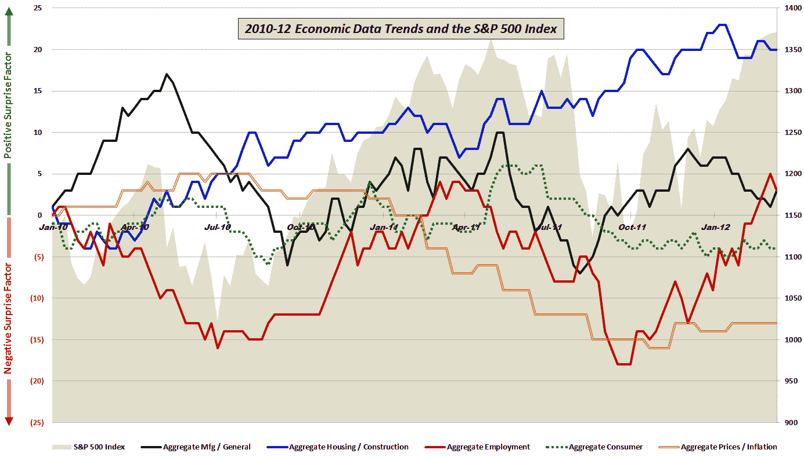

<!--yml

类别：未分类

日期：2024-05-18 16:36:16

-->

# VIX and More: 经济数据与预期相比：股市和就业数据自 10 月以来一直在反弹

> 来源：[`vixandmore.blogspot.com/2012/03/economic-data-vs-expectations-stocks.html#0001-01-01`](http://vixandmore.blogspot.com/2012/03/economic-data-vs-expectations-stocks.html#0001-01-01)

五周前，在[《经济数据：股市的分歧还是确认？》](http://vixandmore.blogspot.com/2012/02/economic-data-divergence-or.html)一文中，我查看了 1 月份的一些令人失望的经济数据，并想知道这些数据是否是市场应该忽视的异常值，还是表明经济正在失去一些活力。

在那次 2 月的分析中我指出：

> “在这次更新中，我注释了图表，显示制造业和[就业](http://vixandmore.blogspot.com/search/label/employment)在股市上涨中是经济基础。这次就业数据似乎正在正确的方向上发展，但制造业却难以达到预期——至少在过去两个月。”*

有了更多的 hindsight，看来就业形势比最初预期的还要强劲。实际上，回顾到 10 月初股市触底时，自那时以来的改善就业情况几乎完美地与股市上涨的表现一致。另一方面，自 12 月初以来，制造业和更广泛的经济活动数据低于预期而不是超过预期的次数更多——股市继续忽视这一趋势。

下面的图表评估了自 2010 年初以来的五个经济活动组（制造业/一般、房地产/建筑、就业、消费者和价格/通胀）的经济数据与预期相比的情况，并绘制了每个类别的正面和负面惊喜的相对水平与标普 500 指数的表现。

一年前，就业增长相对于预期几乎达到了顶峰，而制造业将继续在接下来的两个月左右发布正面惊喜。随着 2012 年就业市场预期的提高，数据是否可能继续带来更多看涨的惊喜？

*[对那些对本文图表中包含的组成部分数据和所使用的方法感兴趣的读者，建议查看下面的链接。对于那些寻求关于具体的经济数据发布细节，这些数据是我综合数据计算的一部分，请查看* [*图表一周：2010 年的经济数据*](http://vixandmore.blogspot.com/2011/01/chart-of-week-year-in-economic-data.html)*。]*

相关文章：

******

***披露（s）：*** *无*

*[数据来源：多样化的]*
