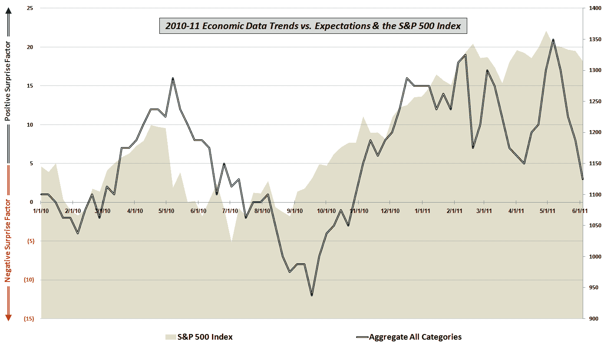

<!--yml

类别：未分类

日期：2024-05-18 16:49:57

-->

# VIX 和更多：经济数据与预期和股票价格

> 来源：[`vixandmore.blogspot.com/2011/06/economic-data-vs-expectations-and-stock.html#0001-01-01`](http://vixandmore.blogspot.com/2011/06/economic-data-vs-expectations-and-stock.html#0001-01-01)

过去一年里，我一直发布各种经济数据报告趋势与共识预期对比的图表。在上一次的[持续低迷的数据与预期](http://vixandmore.blogspot.com/2011/04/continued-lackluster-economic-data-vs.html)中，我评论说四月的数据显示“制造业和就业不再相对于预期提供积极惊喜，而与消费者相关的数据显示消费者活动至多只能算得上是缓慢。”

在经历了几周的积极惊喜之后，过去四周的趋势一直是在预期之下持续缺失。事实上，在明天就业报告之前的四周是自 2010 年初我开始整理此类数据以来，与预期相比最糟糕的四周。

为了关注整体趋势，这次我没有像过去那样将数据分为五组（制造业/综合、房地产/建筑、就业、消费者和价格/通胀）。相反，下面的图表只是将相对于预期的综合数据与 2010 年初至今的 SPX 一起绘制在周图上。

图表在一定程度上显示股票价格和数据惊喜在过去一年半里高度相关，如果有延迟，也是非常短暂的。毫不奇怪，最近的数据趋势急剧下降。尚不清楚这是否是日本干扰全貌揭晓前的暂时性颠簸，或者全球经济现在是否面临一些大的结构性逆风。当然，最近数据与股票的解耦是不寻常的——可能会在明天早上达到高潮。

对此图表中包含的经济数据细节和所使用方法感兴趣的读者，建议查看下面的链接。

相关文章：

***披露(s):*** *无*
