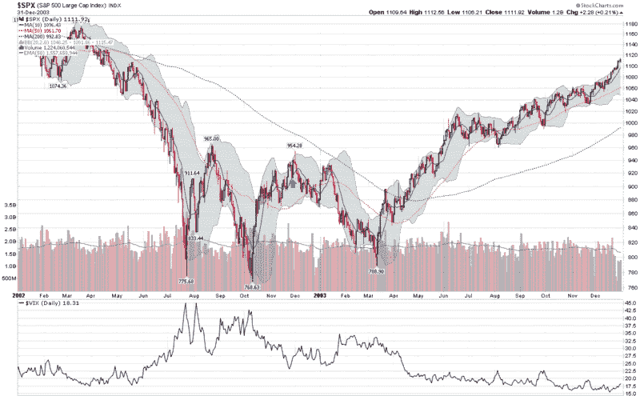

-   <!--yml

-   分类：未分类

date: 2024-05-18 17:45:00

-   -->

# VIX and More: Eerie Déjà Vu as VIX and SPX Both Jump More Than 2.5%

> -   来源：[`vixandmore.blogspot.com/2009/06/eerie-deja-vu-as-vix-and-spx-both-jump.html#0001-01-01`](http://vixandmore.blogspot.com/2009/06/eerie-deja-vu-as-vix-and-spx-both-jump.html#0001-01-01)

If you follow me on Twitter ([VIXandMore on Twitter](http://twitter.com/VIXandMore)), you probably saw my surprise when I asked rhetorically, “When is the last time the VIX was making new intraday highs with the $DJIA up 230?”

-   虽然我不能回答那个问题（尽管我猜测今天是第一次），但我确实检查了今天的收盘是否创下了 VIX（+3.87%）和 SPX（+2.58%）在同一日涨幅最大的记录。

-   结果是，在今天的双峰之前，有一次先前的实例，是在 2002 年 11 月 27 日，那天是感恩节前一天。那天，VIX 上涨了 4.93%，SPX 上涨了 2.80%。

-   我查看了图表，看看 11 月 27 日如何 fit into 2002-03 年熊市低点。结果是，我在下面的图表中用紫色箭头标记的 11 月 27 日，正是两天后出现一个中级高点，随后是一个 17.3%的下跌，导致了大约 3 个半月后的最终底部过程。从这一点开始，市场开始反弹，并且持续了超过四年的多头趋势。

-   下面的图表回顾了[2002](http://vixandmore.blogspot.com/search/label/2002)年非常相似的历史。在那一年，与互联网泡沫破裂相关的熊市首先在 7 月触底，然后在 10 月再次触底，达到 768 点。从 10 月的低点，市场反弹至 11 月 27 日的 939 点——这些数字与 2008 年 11 月的低点和随后 2009 年 1 月的最高点惊人地相似。

In 2003, the SPX put in a third and final bottom of 788.90 on March 12^(th), before stocks rallied and never looked back.

-   今天的问题是，当前的市场，是否像 2002 年 11 月 27 日一样，还有至少一次剧烈的下跌...或者当前的情况更像 2003 年 5 月新牛市的开端？

-   为了记录，当我放宽了 VIX 和 SPX 同时跳跃的条件时，距离今天和 1990 年 11 月 27 日最近的日期是 1990 年 5 月 11 日。当时，股市正处于一个持续两个月才结束的上涨趋势中，之后在同年 7 月至 10 月间因一次 19.8%的下跌而中断。

-   具有统计学意义？当然不是。有趣的是，基于 anecdotes?我认为是。

[Finally, if the chart from 2002-03 looks familiar check out Sunday’s [Chart of the Week: Emerging Markets](http://vixandmore.blogspot.com/2009/05/chart-of-week-emerging-markets.html). I had to double check to make sure I had not posted the wrong chart.]

*[source: StockCharts]*
