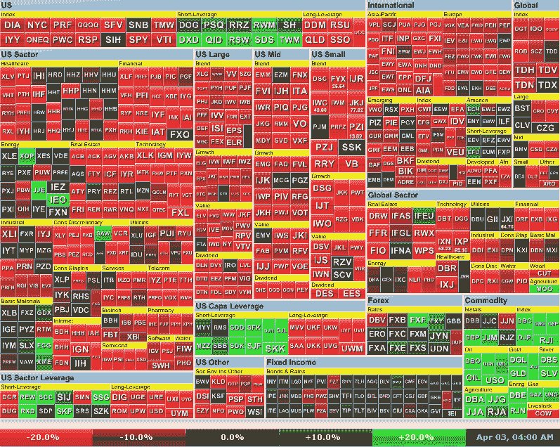

<!--yml

类别：未分类

日期：2024 年 05 月 18 日 18:39:09

--> 

# 波动指数和更多：股票还是大宗商品？

> 来源：[`vixandmore.blogspot.com/2008/04/equities-or-commodities.html#0001-01-01`](http://vixandmore.blogspot.com/2008/04/equities-or-commodities.html#0001-01-01)

自 2000-2003 年的熊市触底并启动以来，股票和大宗商品基本上一直在一起上涨。这种关系在股票市场于 10 月中旬达到顶峰时终结。自那时起，正如下图所示，SPX 一直在下跌，而[路透/杰富瑞 CRB 指数](http://www.jefferies.com/cositemgr.pl/html/ProductsServices/SalesTrading/Commodities/ReutersJefferiesCRB/index.shtml)一直在上涨。尽管这些指数的方向最近发生了变化，但反向关系似乎仍然存在。下图中的 SPX 和 CRB 图表显示，大宗商品在大约两周前转跌，就在股票市场触底之前。

对于这种变化的一个快速而肮脏的解释可能是，去年 8 月和 9 月，随着市场触顶，有关信贷市场的担忧引起了投机资金从股票市场撤离，并且联邦储备开始降息。联邦储备的行动显然导致许多投资者更加担心通货膨胀，并推动他们朝着资产，比如大宗商品，这些资产在通货膨胀环境中历史上表现良好的方向上投资。

除了 StockCharts.com 的 SPX 和 CRB 图表之外，我还包括了一份六个月热力图，由[FINVIZ.com](http://finviz.com/index.ashx)提供，它生动地显示了过去六个月期间，大宗商品是少数表现强劲的领域之一。

当金融公司去杠杆化时，可能会限制投机性的赌注，要么限于股票，要么限于大宗商品，所以重要的是要关注哪种资产类别目前吸纳了大部分闲置资金。当事情发展时，我会更新这个故事。

*[图表：StockCharts*]

*[图表：FINVIZ.com*]
