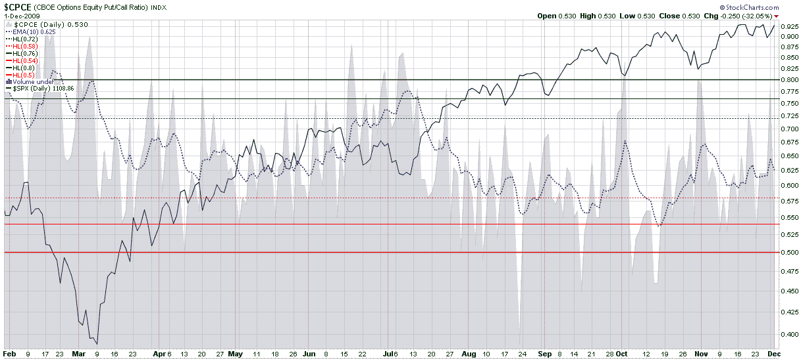

<!--yml

分类：未分类

日期：2024-05-18 17:21:28

-->

# 标题：VIX and More: Equity Put to Call Ratio Not Pointing to Correction

> 来源：[`vixandmore.blogspot.com/2009/12/equity-put-to-call-ratio-not-pointing.html#0001-01-01`](http://vixandmore.blogspot.com/2009/12/equity-put-to-call-ratio-not-pointing.html#0001-01-01)

最近[迪拜](http://vixandmore.blogspot.com/search/label/Dubai)的债务危机促使一些投资者获利了结，保护他们的投资组合，并思考全球经济的公认和隐性威胁。从周三收盘到周五盘中低点，标普 500 指数（SPX）仅下跌 17 点或 2.4%，这并不是通常会让多头感到恐慌的下跌。然而，投资者担心进一步的下跌可能即将到来，于是在周一积极买入看跌期权，看跌买入推动 CBOE 股票[看跌/看涨](http://vixandmore.blogspot.com/search/label/put%20to%20call)比率（[CPCE](http://vixandmore.blogspot.com/search/label/CPCE)）达到高位。

在下面的图表中，我复制了 CPCE 指标，并加上了 10 日指数移动平均线（虚线蓝色线条），以平滑两周内的数据。图表显示，自当前牛市七月份的阶段以来，标普 500 指数（实线黑色线条）出现显著回调前，10 日 CPCE 的指数移动平均线都曾跌破 0.58 水平。事实上，在过去 5 个半周内，10 日指数移动平均线从未威胁到 0.58 区域，在当前的 0.625 水平，CPCE 显示没有任何即将修正的迹象。

关于 CPCE 的相关文章，读者可以查看：

***声明：***无*
