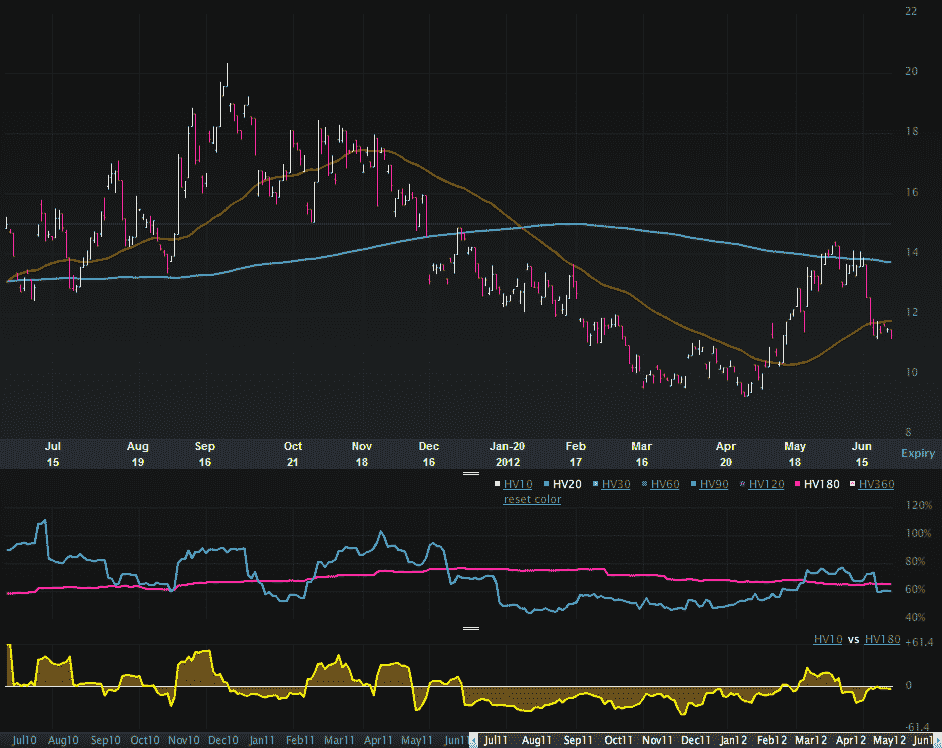

<!--yml

类别：未分类

日期：2024-05-18 16:27:37

-->

# VIX and More: Euro Volatility and Risk

> 来源：[`vixandmore.blogspot.com/2012/06/euro-volatility-and-risk.html#0001-01-01`](http://vixandmore.blogspot.com/2012/06/euro-volatility-and-risk.html#0001-01-01)

随着欧元区峰会日益临近，投资者正纷纷寻找各种衡量标准来评估金融市场可能出现的剧烈波动的风险。根据我收到的某些邮件，许多人目前对 VIX 持怀疑态度，该指数目前处于中 19 年代，比其历史平均值低 5%。在 27.54，[VSTOXX](http://vixandmore.blogspot.com/search/label/VSTOXX)（EURO STOXX 50 波动指数）显示出更多的不确定性，但即使这个数字也是相对于过去三个月 VSTOXX 的范围来说较低的。

无论焦点是[西班牙](http://vixandmore.blogspot.com/search/label/Spain)、[意大利](http://vixandmore.blogspot.com/search/label/Italy)还是[希腊](http://vixandmore.blogspot.com/search/label/Greece)，投资者真正想要得到答案的问题最终都围绕着[欧元](http://vixandmore.blogspot.com/search/label/euro)的未来。我已经在各种[Intrade](http://vixandmore.blogspot.com/search/label/Intrade)合同（见下文链接）的背景下讨论了这个问题，关于一个或多个国家离开欧元区的风险，但另一种被忽视的测量欧元风险和不确定性的方法是 CBOE 欧元货币波动指数（[EVZ](http://vixandmore.blogspot.com/search/label/EVZ)）。有时被称为“欧元 VIX”，EVZ 使用 VIX 的方法来衡量市场对欧元未来波动的预期。因此，理论上，EVZ 也应该是欧元风险和不确定性的代理。人们甚至可以进一步认为 EVZ 是欧元区恐惧指标。

那么在另一个欧元区峰会前夕，EVZ 图表告诉我们什么？

下图显示，当前的 EVZ 为 11.27，目前处于过去一年 9.23 – 20.34 范围的下部。实际上，EVZ 只处于过去一年范围内值的 18%。同样值得注意的是，当前 EVZ 的 20 日历史波动率（60）低于 180 日历史波动率（65）——在过去六个月中的大多数时间都是这样。最后但并非最不重要的是，自 6 月 18 日以来，EVZ 一直处于显著的下降趋势。

尽管头条新闻不断，但交易员认为目前欧元中的货币风险并不大，至少与去年相比，且就 EVZ 定义的 30 天前瞻性窗口而言。

所以，如果你认为 VIX 被低估，并且低估了市场风险，那么不要期望 EVZ 会发出不同的信号。在当前水平，货币风险和不确定性似乎出奇地低。如果你认为市场低估了欧元汇率的大幅波动潜力，那么可以考虑买入一些欧元的[跨式期权](http://vixandmore.blogspot.com/search/label/straddle)或其 ETF 对应产品[FXE](http://vixandmore.blogspot.com/search/label/FXE)。

相关文章：

数据来源：[LivevolPro.com]

**声明：** Livevol 是 VIX and More 的广告商。
