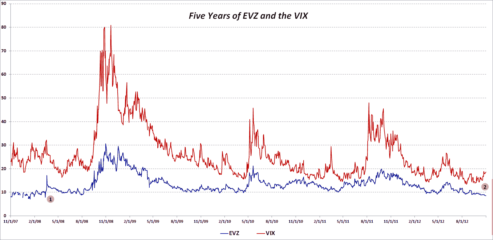

<!--yml

category: 未分类

date: 2024-05-18 16:24:10

-->

# VIX 和更多：欧元货币波动指数（EVZ）自 2008 年 3 月以来最低水平，与 VIX 分离

> 来源：[`vixandmore.blogspot.com/2012/10/eurocurrency-volatility-index-evz-at.html#0001-01-01`](http://vixandmore.blogspot.com/2012/10/eurocurrency-volatility-index-evz-at.html#0001-01-01)

自 2008 年 8 月推出以来，CBOE 欧元货币波动指数（股票代码[EVZ](http://vixandmore.blogspot.com/search/label/EVZ)，有时简称为“[欧元](http://vixandmore.blogspot.com/search/label/euro)VIX”），基于[FXE](http://vixandmore.blogspot.com/search/label/FXE) ETF，与一些更著名的波动指数相比，一直默默无闻。

考虑到过去几年关于[欧洲主权债务危机](http://vixandmore.blogspot.com/search/label/European%20sovereign%20debt%20crisis)的[恐惧](http://vixandmore.blogspot.com/search/label/fear)情绪，我觉得人们对 EVZ 的兴趣缺乏令人惊讶。毕竟，在思考欧元区时，最基本的问题之一就是欧元是否能够幸存。此外，至少在美国之外，欧元区的未来仍然被认为是[股市最大的风险](http://vixandmore.blogspot.com/2012/10/us-fiscal-cliff-fears-top-vix-and-more.html)。

所有这些都在脑海中，我今晚查看了 EVZ 数据，发现今天标志着 CBOE 提供的 EVZ 历史数据（从 2007 年 11 月到 2008 年 8 月推出的重建数据填补了空白）开始的五周年。

下面的图表显示了 EVZ（蓝线）的收盘价历史，以及 VIX（红线）的比较收盘价。我在图表上做了注释，以突出两条信息：

1.  EVZ 的收盘价最后一次低于今天（8.55）是在 2008 年 3 月，就在贝尔斯登崩溃并被摩根大通（[JPM](http://vixandmore.blogspot.com/search/label/JPM)）收购之前。

1.  9 月中旬以来，EVZ 和 VIX 的走势分离，近期这种分离尤其不寻常，尤其是考虑到分离的时间长度

所以…EVZ 是在低估欧元风险还是在高估股票风险？这两种风险度量有可能同时朝相反方向变动并且都是正确的吗？

相关文章：

**

*[source(s): CBOE]*

***披露(s):*** *无*
