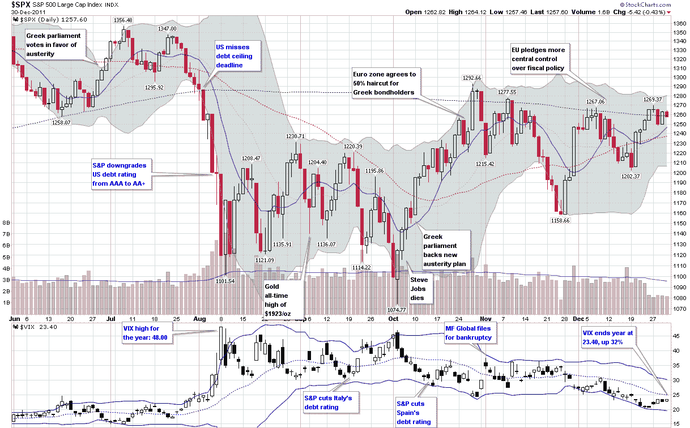

<!--yml

分类：未分类

日期：2024-05-18 16:13:14

-->

# VIX 和更多：事件风险、事件θ和下周

> 来源：[`vixandmore.blogspot.com/2013/10/event-risk-event-theta-and-next-week.html#0001-01-01`](http://vixandmore.blogspot.com/2013/10/event-risk-event-theta-and-next-week.html#0001-01-01)

对于投资者/交易员来说，周末带来了一系列有趣的问题，特别是在存在正在进行中的危机或合理的风险下周会有新的危机的情况下。今天我们面临一个令人困惑的局面，既有老危机（政府关门），又有新危机即将来临（[债务上限](http://vixandmore.blogspot.com/search/label/debt%20ceiling)限制），这两个危机越来越有可能合并成一场更大的危机。

投资者应该如何看待当前形势？首先，他们需要对事件风险形成一些看法，包括从政府关门和债务上限的快速全面解决到导致美国违约的长期僵局的一系列情景。有趣的是，为这些情景分配概率，提出一个以概率为权重的未来观点，并在考虑风险和潜在收益后做出（半）理性的投资组合保护和投机机会决策。听起来很简单，不是吗？

一些投资者可能没有完全认识到事件风险或[事件波动性](http://vixandmore.blogspot.com/search/label/event%20volatility)是一把双刃剑。当然，有很大风险我们再次高估了许多被选举出来的官员的能力，让他们代表国家和我们重温 2011 年 8 月那些美好的记忆，但也有风险，周末可能会有所进展——甚至是一个小小的迹象表明形势正在转变——从而使股票在周一随着空头吸收大部分损失而飙升。为这些情景分配一个有意义的概率可能看起来是徒劳的，但在脑海中演练这些情景以了解其含义肯定是值得花一点多余的脑力的。

在 2011 年债务上限危机前三个月，日本遭受了地震、海啸和核泄漏的三重危机。我在[福岛第一核电站与事件θ](http://vixandmore.blogspot.com/2011/03/fukushima-daiichi-and-event-theta.html)一文中谈到了这次危机，甚至发明了一个新术语，“[事件θ](http://vixandmore.blogspot.com/search/label/event%20theta)，”来描述时间推移对于那些在波动性或其他工具中持仓的人来说是积极还是消极的发展。

> “在这些事件逐步展开时，似乎像是一出慢动作的火车出轨，我一直问自己时间是否站在那些试图限制核设施及其周边地区损害的人一边，或者说，这是否是一个正的时间 theta 事件（时间对我们有利）还是一个负的时间 theta 事件（与时间赛跑）。我不是核能领域的专家，知道某些因素可能会迅速失控，但同时也知道工厂中的一些过程正在进行稳定化努力，我只能猜测当前的努力更有可能功亏一篑，导致恶性循环，还是有望遏制问题，使救援队伍的形势转危为安。
> 
> 知道这是否是一个正的时间 theta 事件或负的时间 theta 事件对投资策略有重大影响。从对冲的角度来看，事件 theta 可能会影响对冲工具的选择，预计的对冲时机，对冲可能如何构建以及适当的定价。对于投机性投资者来说，事件 theta 还可以帮助确定风险回报支付结构以及随时间如何变化。任何交易 VIX 期货并每日处理 VIX 期限结构的人都应该对事件 theta 与期限结构之间的潜在不匹配有一些见解。”

我认为在本周的大部分时间里，事件 theta 都是负面的，这意味着在没有实质性进展接近协议的情况下，时间的流逝对股市不利，对长期波动性头寸的持有者有利。随着周末的来临，还有另外两天多的新闻周期，民意调查数据和幕后策略，事件 theta 可能更接近中性，甚至可能是积极的。这并不是说空头应该在本交易日结束前平仓他们的头寸，或者任何持有长期波动性头寸的人都应该平仓获利，只是指出，至少在周一市场开盘之前，多头和空头风险变得更加平衡，确定各种头寸的风险回报支付变得更加困难。

在周末到来之前，投资者可能希望思考一下 2011 年的债务上限危机，2012 年的[自动减支](http://vixandmore.blogspot.com/search/label/sequestration)斗争以及 2013 年僵局可能如何发展。与此同时，下面的图表[摘自[VIX 和波动性年度回顾（2011 年）](http://vixandmore.blogspot.com/2012/01/year-in-vix-and-volatility-2011.html)]以及下面的链接应该会让人思考这些以及许多相关问题。

来源：[StockCharts.com, VIX and More]

相关文章：

***披露：*** *无*
