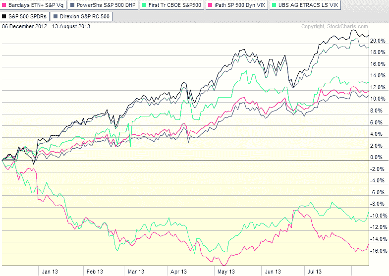

来源：[`vixandmore.blogspot.com/2013/08/expanded-performance-of-volatility.html#0001-01-01`](http://vixandmore.blogspot.com/2013/08/expanded-performance-of-volatility.html#0001-01-01)

[图片中的低波动率故事](http://vixandmore.blogspot.com/2013/03/the-low-volatility-story-in-pictures.html)

第一组有两个 ETP：

[有史以来 VIX 波动的第 11 次高峰（以及 VIX 波动数据的宝库）](http://vixandmore.blogspot.com/2013/02/all-time-vix-spike-11-and-treasure.html)

# SPY（黑线），主要作为参考

> 第二组包含了基于 VIX 的动态对冲产品的核心：

[2012 年 VIX ETP 的表现](http://vixandmore.blogspot.com/2013/01/vix-etp-performance-in-2012.html)

1.  有趣的是，这些证券的表现似乎分成了三个不同的组别。

1.  这些问题与股市的回调有关，与它们相关的 VIX 波动，这些事件发生时如何最小化投资组合的波动性以及各种[VIX 交易所交易产品](http://vixandmore.blogspot.com/search/label/VIX%20ETN)的含义。

1.  -->

1.  日期：2024-05-18 16:14:03

当我最近整理了[2013 年上半年的热门文章](http://vixandmore.blogspot.com/2013/07/top-posts-of-2013-through-first-half-of.html)时，几个主题跃然纸上。本年度的前四篇博文总结了今年许多投资者所担忧的问题：

第一信托 CBOE 标普 500 尾随对冲基金 ETF ([VIXH](http://vixandmore.blogspot.com/search/label/VIXH)), 本质上是一个由 99-100%的 SPY 组成，通过动态分配 0-1%的[VIX 期权](http://vixandmore.blogspot.com/search/label/VIX%20options)（浅绿色线）来增强的组合。

分类：未分类

来源：[StockCharts.com]

在过去的一个月里，股市一直在横盘整理，看起来有些疲惫，许多投资者都在考虑如何对一个具有长期股市倾向的投资组合进行对冲。在下面的图表中，我捕捉到了一些可能适合对冲这类投资组合的 ETP 的近期表现。

VIX 和更多：波动对冲和相关 ETP 的扩展表现

+   

+   [SPX 回调在同一图表中的四年](http://vixandmore.blogspot.com/2013/04/four-years-of-spx-pullbacks-in-one-plot.html)

巴克莱 ETN+标普 VQTOR ETN ([VQT](http://vixandmore.blogspot.com/search/label/VQT)), 它根据实际波动率和隐含波动率趋势（红线）动态分配[VIX 期货](http://vixandmore.blogspot.com/search/label/VIX%20futures)。

+   Direxion 标普 500 RC 波动响应份额 ([VSPY](http://vixandmore.blogspot.com/search/label/VSPY)), 它采用了一个市场时机机制，根据市场波动度的测量动态分配股票和债券（蓝绿色线）。

+   

+   PowerShares S&P 500Downside Hedged Portfolio ([PHDG](http://vixandmore.blogspot.com/search/label/PHDG))，类似于 VQT，它有 VIX 期货的动态分配，并基于[S&P 500 Dynamic VEQTOR Index](http://us.spindices.com/indices/strategy/sp-500-dynamic-veqtor-index-total-return)（深紫色线条）。

底部组包括两个表现者：

+   UBS ETRACS Daily Long-Short VIX ETN ([XVIX](http://vixandmore.blogspot.com/search/label/XVIX)),相当于一个固定分配的 100%多头位置在[VXZ](http://vixandmore.blogspot.com/search/label/VXZ)，减去 50%的空头位置在[VXX](http://vixandmore.blogspot.com/search/label/VXX)。我在这里包括了 XVIX（天蓝色线条），主要是为了展示其表现与 XVZ 多么接近。

+   iPath S&P 500 Dynamic VIX ETN ([XVZ](http://vixandmore.blogspot.com/search/label/XVZ))，利用了[VIX:VXV](http://vixandmore.blogspot.com/search/label/VIX%3AVXV)比率（SPX 30 天隐含波动率对 SPX 93 天隐含波动率）来确定对短期和中期 VIX 期货的动态分配。在这种情况下，对短期 VIX 期货（想想 VXX）的分配可能是多头或空头，而对中期 VIX 期货的分配总是多头，尽管它是可变的（紫红色线条）。

请记住，最积极的对冲策略几乎总是在牛市期间表现最差。如果你想要一个完全不同的视角，了解这些产品在股市大幅下跌时的表现，请查看[VIX ETP 在当前抛售中的对冲表现](http://vixandmore.blogspot.com/2012/04/performance-of-vix-etp-hedges-in.html)。

下面的链接提供了一些这些产品的背景信息以及性能数据，应为更深入研究提供了极好的起点。

相关文章：

***披露(s):*** *写作时持有 VQT 多头和 VXX 空头*
