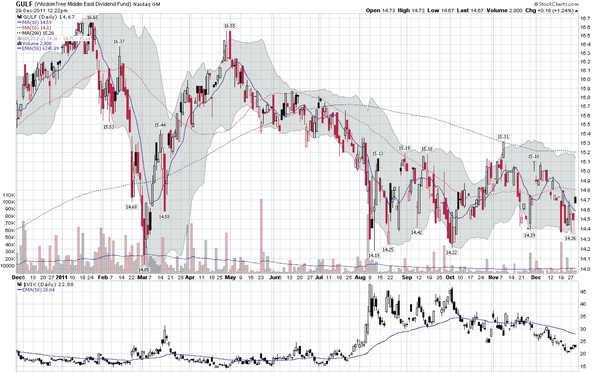

<!--yml

category: 未分类

date: 2024-05-18 16:44:51

-->

# VIX and More: Expectations, Surprises and Fear in 2011

> 来源：[`vixandmore.blogspot.com/2011/12/expectations-surprises-and-fear-in-2011.html#0001-01-01`](http://vixandmore.blogspot.com/2011/12/expectations-surprises-and-fear-in-2011.html#0001-01-01)

在过去三年里，假日季节总是给我留下了新的收获：[Bespoke Investment Group](http://www.bespokeinvest.com/)详细问卷的赠品，为[年度圆桌会议](http://bespokepremium.com/roundtable/)提供原始材料……毫无疑问，对于贾斯汀、保罗和他们的团队，这无疑是一种幽默。

在 Bespoke 圆桌会议的首次年度中，我的 2010 年的水晶球估计证明出人意料地准确，自然地引导我反思年度事件时，我开始辩论运气与技能的相对影响。

当我对 2011 年作出预测时，我特别担心欧洲和[中国](http://vixandmore.blogspot.com/search/label/China)，但在一月还没过完之前，[阿拉伯之春](http://vixandmore.blogspot.com/search/label/Arab%20Spring)的到来开始深刻和戏剧性地改变世界，跨越了宗教、政治和经济的维度。虽然整个一月和二月，波动率指数（VIX）几乎一直在十几岁，但我怀疑，当我们再过十年左右回顾 2011 年的事件时，北非和中东广泛的动荡可能会对世界产生比年度其他任何事件都更深远的长期影响。

随着阿拉伯之春继续地理扩展，一系列灾难震撼了日本，首先是规模 9.0 的[东北地震和海啸](http://en.wikipedia.org/wiki/2011_T%C5%8Dhoku_earthquake_and_tsunami)，随后是福岛第一核电站的核泄漏事故。

虽然欧洲和中国在背景中逐渐升温，但全球却发生了两件重大而意想不到的事件，两者都引发了大量的后续影响。

欧洲的事件在年中开始升温，但由于对**美国债务上限危机**的日益焦虑和政治僵局的增加，它们在很大程度上被掩盖了，似乎阻碍了解决这一危机的方案。直到部分性地达成了对债务上限问题的“解决方案”并且标准普尔将美国的信用评级从 AAA 降至 AA+之后，[欧洲主权债务危机](http://vixandmore.blogspot.com/search/label/European%20sovereign%20debt%20crisis)才再次成为中心舞台，这一次在整个年度的剩余时间内搅动了市场。

回顾起来，要预见到 2011 年的一些惊喜，需要掌握像阿拉伯社会动荡、板块构造学、美国及其他国家的政府内部运作等遥远领域的专业知识。除此之外，要判断一个看似无害的发展何时会突然失控演变成危机，从来都不是易事。这种类型的知识更加难以捉摸，需要理解像“[不稳定的手指](http://vixandmore.blogspot.com/search/label/fingers%20of%20instability)”这样的概念，马克·布坎南在《普遍性：为什么灾难会发生》一书中详细讨论了这一概念——这也是我将在 2012 年进一步探讨的主题。

归根结底，2012 年面临的大部分风险都是显而易见的：欧洲、中国、伊朗、朝鲜等。

让期权卖家夜不能寐、常常在投资组合上造成巨大损失的，是那些潜藏在表面之下的[未知未知](http://en.wikipedia.org/wiki/There_are_known_knowns)因素。

相关文章：

来源：[StockCharts.com](https://www.stockcharts.com/)

***披露信息：*** 无
