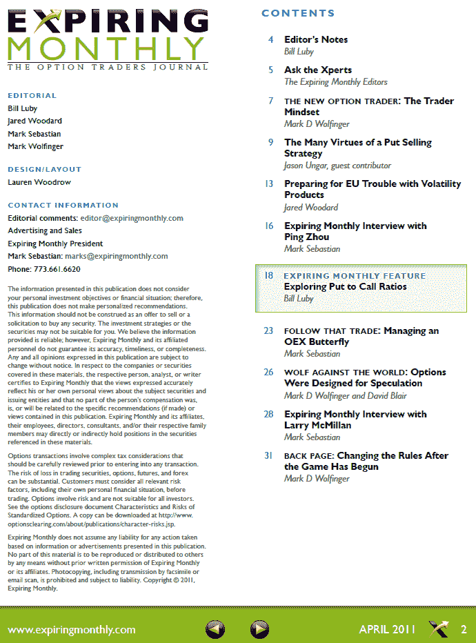

<!--yml

分类：未分类

日期：2024-05-18 16:51:46

-->

# VIX and More: Expiring Monthly April 2011 Issue Recap

> 来源：[`vixandmore.blogspot.com/2011/04/expiring-monthly-april-2011-issue-recap.html#0001-01-01`](http://vixandmore.blogspot.com/2011/04/expiring-monthly-april-2011-issue-recap.html#0001-01-01)

《[*Expiring Monthly: The Option Traders Journal*](http://www.expiringmonthly.com/)》四月份的期刊已于昨天发布（按照我们的习惯，在期权到期后的周一发布），可供订阅者下载。[下载](https://www.expiringmonthly.com/customer/account/login/)。

在 本月期刊中，我撰写了特写文章《探索看涨与看跌比率》。这 与杂志内容的主体有些许偏离，杂志继续聚焦期权作为交易工具。然而，对 我们中的许多人来说，期权不仅是高度灵活的交易工具，也是许多 可以作为指标的数据片来源，其中最著名的是 VIX 和看涨与看跌比率。

在《Expiring Monthly》当前期刊中，我最喜欢的文章包括对著名期权大师 Larry McMillan 的 Mark Sebastian 采访；Jason Ungar 关于 CBOE 看跌指数([PUT](http://vixandmore.blogspot.com/search/label/PUT))的客座文章；以及 Jared Woodard 关于针对[欧洲主权债务危机](http://vixandmore.blogspot.com/search/label/European%20sovereign%20debt%20crisis)的三个波动性策略的引人深思的文章。

Mark Sebastian 还采访了 Ping Zhou，他是《Trading on Corporate Earnings News》的合著者，并撰写每月的“跟随交易”专栏，该专栏专注于 OEX 蝴蝶的持仓管理。Mark Wolfinger 继续是多产的贡献者，他讨论了期权经纪人在到期周期最后交易日对客户交易设限的问题，辩论了期权作为投机工具的角色，并向新期权交易者提供了一些关于风险、时机和资金的思考。

总的来说，我对我们第十四期刊的质量感到非常满意，为收到的积极反馈感到兴奋，也为即将到来的几个月中正在成形的文章感到激动。

遵 循传统，我在下面复制了四月期刊的目录表，供那些想了解更多关于杂志内容的人参考。感谢所有已经订阅的人。对于那些想了解订阅信息以及杂志更多细节的人，你们可以在（全新设计的） [`www.expiringmonthly.com/`](http://www.expiringmonthly.com/) 找到所有内容。

相关文章：

*[来源：Expiring Monthly]*

***披露(s):*** *我是 Expiring Monthly 的创始人之一和所有者*
