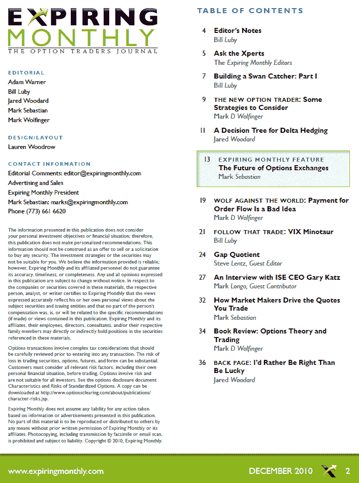

<!--yml

分类：未分类

日期：2024-05-18 16:55:49

-->

# VIX and More: 2010 年 12 月《Expiring Monthly》杂志回顾

> 来源：[`vixandmore.blogspot.com/2010/12/expiring-monthly-december-2010-issue.html#0001-01-01`](http://vixandmore.blogspot.com/2010/12/expiring-monthly-december-2010-issue.html#0001-01-01)

提醒一下，[《Expiring Monthly: 期权交易者杂志》](http://www.expiringmonthly.com/)的十二月刊昨天已经发布，可供订阅者下载。[`www.expiringmonthly.com/members/`](http://www.expiringmonthly.com/members/)

这期的专题文章由 Mark Sebastian 撰写，讨论了期权交易所的未来。与此相关的话题，Mark Longo 采访了国际证券交易所（ISE）的总裁兼首席执行官 Gary Katz ([ISE](http://vixandmore.blogspot.com/search/label/ISE))。杂志还涵盖了市场制造商如何使用波动性更新他们的报价、Delta 对冲、分析开盘缺口趋势、订单流量支付、定向与非定向策略、交易中运气和技巧的角色，以及 Ron Ianieri 最近期权书籍的评论。

我为本月的杂志贡献了两篇文章。无意中将拟态与神话混淆，其中一篇文章是基于我称为“牛头怪”的交易，而另一篇则被称为“天鹅捕手”。牛头怪最终是一个 VIX 和[VXX](http://vixandmore.blogspot.com/search/label/VXX)的配对交易，在这里我展开了一个概念验证方法。天鹅捕手交易也代表了一种自下而上的方法来开发期权策略。在一个两部分的系列文章的第一部分，我寻求一种结构期权头寸的方法，以从市场的极端波动中获利，同时在一个等待这些事件发生的过程中不会损失太多资金。

如同我现在的习惯一样，我在下面复制了《十二月刊》的目录表，供那些对杂志感兴趣的人了解更多。感谢所有已经订阅的读者。对于那些想要了解订阅信息以及杂志更多细节的人，你们可以在[`www.expiringmonthly.com/`](http://www.expiringmonthly.com/)找到所有相关信息。

相关文章：

*[来源：Expiring Monthly]*

***披露(s):*** *我是《Expiring Monthly》的创始人之一和所有者*
