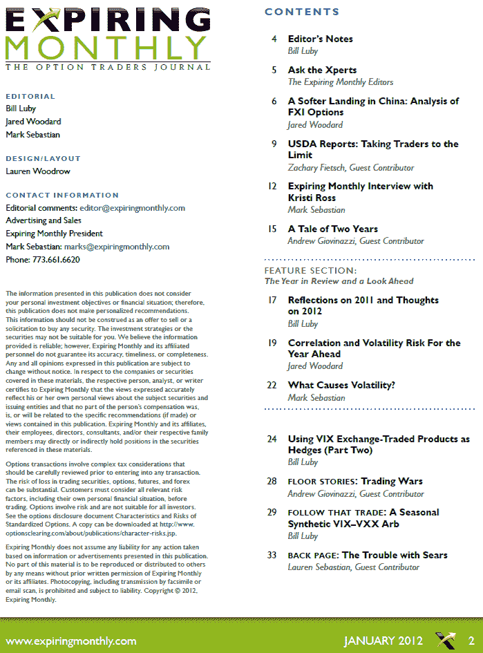

<!--yml

分类：未分类

日期：2024-05-18 16:42:26

-->

# VIX 和更多：2012 年 1 月**Expiring Monthly**杂志回顾

> 来源：[`vixandmore.blogspot.com/2012/01/expiring-monthly-january-2012-issue.html#0001-01-01`](http://vixandmore.blogspot.com/2012/01/expiring-monthly-january-2012-issue.html#0001-01-01)

虽然我过去两周可能休假，但这并不意味着我的大脑完全休息。

事实上，我在 2012 年 1 月的**Expiring Monthly: The Option Traders Journal**（期权交易者杂志）中特别忙碌，该杂志上周出版，订阅者可以[下载](https://www.expiringmonthly.com/customer/account/login/)。正如下面目录所示，这次我写了三篇文章，都有独特的 VIX 特色：

+   2011 年的反思和 2012 年的展望

+   使用 VIX 交易所交易产品作为对冲（第二部分）

+   跟随那个交易：季节性合成 VIX–VXX 套利

如上周在此[VIX-VXX Minotaur Trade](http://vixandmore.blogspot.com/2012/01/vix-vxx-minotaur-trade.html)文章中提到的，最后一篇这三篇文章进一步发展了我最初在 2010 年 12 月杂志上发表的一些想法。

自从一些读者表示对我的**Expiring Monthly**杂志中所有文章标题感兴趣后，我打算在本周末发布一个完整的列表。

最后，现在我回到了网络，我可以致力于在我离开期间发生的一些发展研究——所以期待我今天晚些时候恢复定期发文。

对于那些对订阅信息和杂志详细信息感兴趣的人，您可以在（全新设计的）[`www.expiringmonthly.com/`](http://www.expiringmonthly.com/)找到所有信息。在此标签下，可以找到先前的所有问题（以及我的部分研究兴趣）：[Expiring Monthly 标签](http://vixandmore.blogspot.com/search/label/expiring%20monthly)。

相关文章：

**来源：Expiring Monthly**

**披露（s）：** *在撰写本文时持有 VXX 的空头仓位；我是 Expiring Monthly 的创始人之一和所有者*
